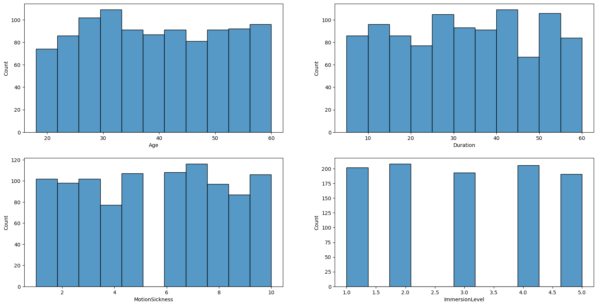
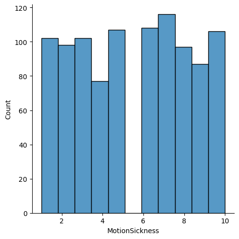
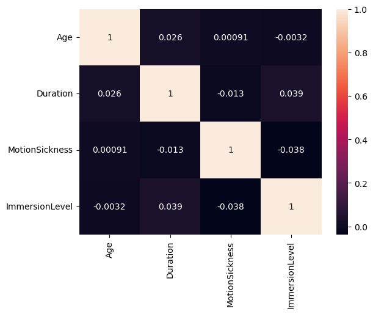
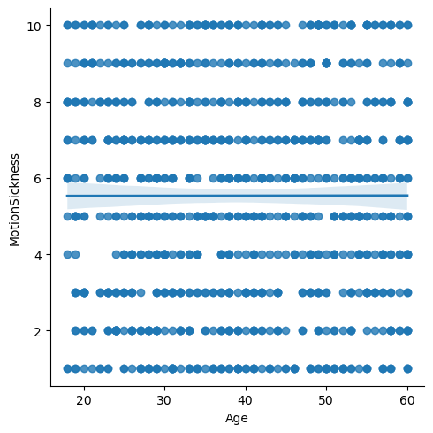
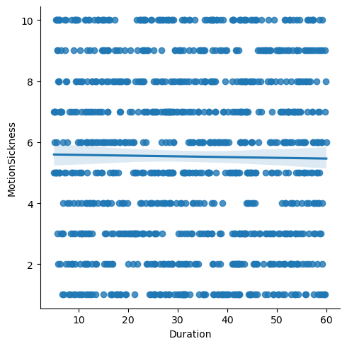
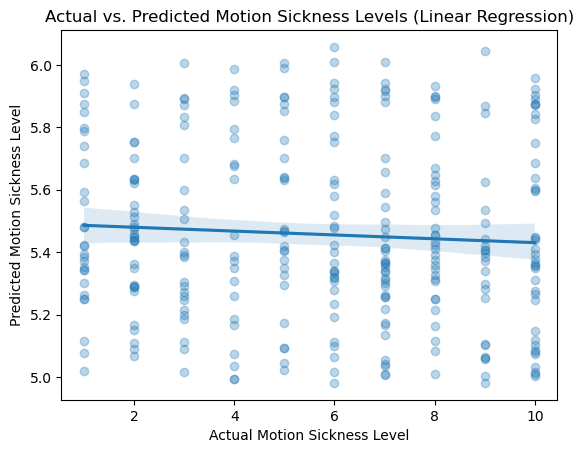
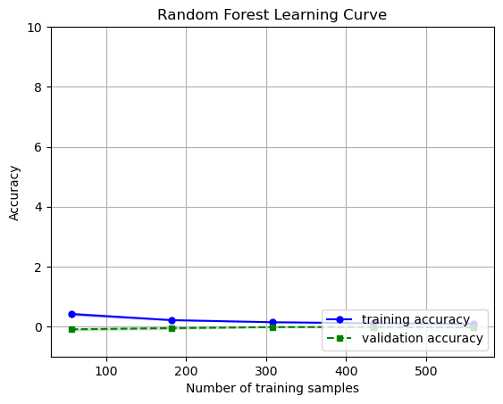
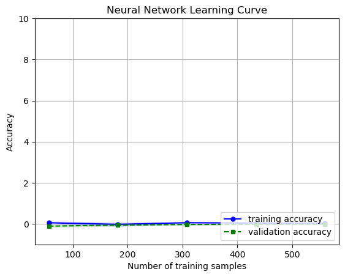
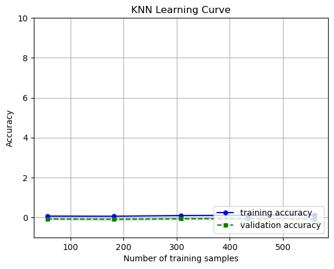
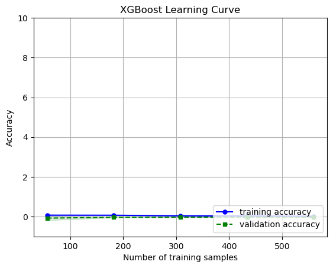

# An Analysis on Factors of Motion Sickness in Relation to Virtual Reality

# Names

- Eldrick Dean Solano 
- Sailor Alfonzo
- Wonjae Lee
- David Wang
- Alexander Tang
- Kai Stern

# Overview

Our group analyzed a dataset consisting of Virtual Reality users to determine if there was any correlation between the intensity of motion sickness experienced by the user and certain characteristics of the user (Age, gender, duration of experience, type of headset, and immersion level). We looked through the dataset with some initial visualizations of our variables. We then attempted to build models to find any correlations in the data. We did not come to any conclusion about the effect of these factors on motion sickness.

# Research Question

How does a variation in VR headset brands and devices impact sensitivity to motion sickness in men, women, and other gender demographics across different age groups?

# Background and Prior Work

In our current day and age, the rapid development of technology has led to the development of more immersive forms of media. One of these attempts was the Virtual Reality headset. However, the human body is not designed to quickly adapt to the constantly shifting environment and focal viewpoint of virtual reality. Motion sickness is an immense problem that affects a variety of genders and ages across a platform of VR headsets. An examination on the usage of virtual reality, motion sickness as a health issue, and generally the relationship between the inclusion of the age and gender variable is necessary to create a proper background for our project.
Virtual reality is a technology that has been experimented with since the mid-1990s and has grown in popularity in the following decades. It allows users to fully immerse themselves into a computer-simulated environment through headsets called head-mounted displays, enabling them to interact with computer-generated worlds (Saredakis et al., 2020). With the advancements in technology, and a rush to capitalize on a potential new market, a wide variety of VR headsets have been released to the public. Examples of uses include immersive video games, remote conferences, and live entertainment such as fashion shows. However, despite the initial hype behind the technology, VR has yet to truly break out of a niche market.

One of the current biggest challenges facing the advancement of virtual reality is the amount of motion sickness experienced when utilizing VR headsets. This issue is a serious detriment to VR’s ability to reach a wider audience and as such multiple studies have explored this issue[^Fernandes2016]. Saredakis et al. (2020) suggests the resolution of the head-mounted display, the refresh rate of the screens, the length of VR use, or the contents of virtual reality (such as movies or video games) as potential causes. This topic has also been studied previously by Howard, M.C., et.al, but simply concludes that “VR sickness produces unequal effects across multiple individual differences” but declines to elaborate on what those effects are, simply stating that “further research is needed”.
    
References: Saredakis, D., Szpak, A., Birckhead, B., Keage, H., Rizzo, A., & Loetscher, T. (2020, May 31). Factors Associated With Virtual Reality Sickness in Head-Mounted Displays: A Systematic Review and Meta-Analysis - PMC. PubMed Central (PMC). https://www.ncbi.nlm.nih.gov/pmc/articles/PMC7145389/
Fernandes, A. S. (2016, March 19). Combating VR sickness through subtle dynamic field-of ... - IEEE xplore. IEE explore. https://ieeexplore.ieee.org/abstract/document/7460053/
Howard, M.C., Van Zandt, E.C. A meta-analysis of the virtual reality problem: Unequal effects of virtual reality sickness across individual differences. Virtual Reality 25, 1221–1246 (2021). https://doi.org/10.1007/s10055-021-00524-3


# Hypothesis


Hypothesis: 
- Older people will be less susceptible to motion sickness as their brains are more developed. 
- Longer durations spent wearing VR headsets leads to increased motion sickness as more time in VR gives the sensation more time to worsen. 
- Gender is uncorrelated with motion sickness. 
- Type of VR headset is correlated with motion sickness.We predict that HTC Vive will be least correlated with motion sickness based on personal experience of group members. 


Null hypothesis: 
- The variables age, duration, and type of VR headset are uncorrelated with motion sickness. 
- Gender is correlated with motion sickness. 


# Data

An ideal dataset for answering our question should include age and gender as variables, additional variables affecting motion sickness, a large number of samples/observations, and a uniformly sampled age range to properly draw correlations between age and motion sickness. It should also have an objective and reliable measure of motion sickness that is recorded and stored with high precision. 

After initial research, the group found a dataset from Kaggle, an online data aggregator website that has a sample dataset with the stated desired information. This would be downloaded as a CSV file, and read as a pandas dataset. The dataset has 1,000 observations with 6 different variables: age, gender, type of VR headset, duration of VR experience, self-reported motion sickness rating, and self-reported immersion level. The Age variable ranges from 18-60, while the Gender column has three values, Male, Female, and Other, Type of VR headset: HTC Vive, Playstation VR, Oculus Rift, the Duration variable ranges from 5-60, motion sickness from 1-10. The group plans to use all 1000 observations as part of the analysis, as these variables and data points are directly related to our research question, and would be used in any analysis/prediction/modeling that might happen during the project. While this data is relatively comprehensive, our ideal data set would include clarification on what the “other” category is for genders. Since the data only encompasses “male”, “female”, and “other”, specification on the “other” category is needed to further refine our information to the additional gender categories that were examined. For now, our group has adapted this “other” category to our question by simply noting that it encompasses the entirety of any gender or non-binary classification that does not include “male” or “female” as the selection.
For the group’s EDA, visualization of the aforementioned variables would be done in order to observe the distribution of each numerical variable. Measures of central tendency would also be taken, such as the mean, median, and mode of each variable. Afterwards, univariate analysis would be done for each independent variable in relation to motion sickness.


# Data Wrangling / Cleaning

First, we download the data from https://www.kaggle.com/datasets/aakashjoshi123/virtual-reality-experiences.

If you are using the below cell, make sure you have a Kaggle API token in a kaggle.json file in ~/.kaggle/. Otherwise, download the data manually and place it under a folder ./data/.


```python
#!mkdir data
#!kaggle datasets download aakashjoshi123/virtual-reality-experiences -p ./data
```


```python
import zipfile
with zipfile.ZipFile('./data/virtual-reality-experiences.zip', 'r') as zip_ref:
    zip_ref.extractall('./data')
```


```python
import pandas as pd
DATA_CSV_PATH = './data/data.csv'

# load csv data
df = pd.read_csv(DATA_CSV_PATH)

df.sample(5)
```


<div>
<style scoped>
    .dataframe tbody tr th:only-of-type {
        vertical-align: middle;
    }

    .dataframe tbody tr th {
        vertical-align: top;
    }

    .dataframe thead th {
        text-align: right;
    }
</style>
<table border="1" class="dataframe">
  <thead>
    <tr style="text-align: right;">
      <th></th>
      <th>UserID</th>
      <th>Age</th>
      <th>Gender</th>
      <th>VRHeadset</th>
      <th>Duration</th>
      <th>MotionSickness</th>
      <th>ImmersionLevel</th>
    </tr>
  </thead>
  <tbody>
    <tr>
      <th>718</th>
      <td>719</td>
      <td>29</td>
      <td>Male</td>
      <td>Oculus Rift</td>
      <td>5.095207</td>
      <td>7</td>
      <td>1</td>
    </tr>
    <tr>
      <th>587</th>
      <td>588</td>
      <td>46</td>
      <td>Other</td>
      <td>HTC Vive</td>
      <td>34.129242</td>
      <td>6</td>
      <td>3</td>
    </tr>
    <tr>
      <th>412</th>
      <td>413</td>
      <td>25</td>
      <td>Other</td>
      <td>PlayStation VR</td>
      <td>50.712142</td>
      <td>8</td>
      <td>2</td>
    </tr>
    <tr>
      <th>39</th>
      <td>40</td>
      <td>45</td>
      <td>Other</td>
      <td>PlayStation VR</td>
      <td>39.828381</td>
      <td>9</td>
      <td>2</td>
    </tr>
    <tr>
      <th>951</th>
      <td>952</td>
      <td>48</td>
      <td>Male</td>
      <td>PlayStation VR</td>
      <td>27.423727</td>
      <td>7</td>
      <td>4</td>
    </tr>
  </tbody>
</table>
</div>


```python
df.shape
```


    (1000, 7)


```python
# check for duplicate values
df.duplicated().sum()
```


    0


```python
# check for null values
df.isnull().values.any()
```


    False


```python
df.sample(5)
```


<div>
<style scoped>
    .dataframe tbody tr th:only-of-type {
        vertical-align: middle;
    }

    .dataframe tbody tr th {
        vertical-align: top;
    }

    .dataframe thead th {
        text-align: right;
    }
</style>
<table border="1" class="dataframe">
  <thead>
    <tr style="text-align: right;">
      <th></th>
      <th>UserID</th>
      <th>Age</th>
      <th>Gender</th>
      <th>VRHeadset</th>
      <th>Duration</th>
      <th>MotionSickness</th>
      <th>ImmersionLevel</th>
    </tr>
  </thead>
  <tbody>
    <tr>
      <th>423</th>
      <td>424</td>
      <td>41</td>
      <td>Female</td>
      <td>Oculus Rift</td>
      <td>38.957797</td>
      <td>1</td>
      <td>2</td>
    </tr>
    <tr>
      <th>565</th>
      <td>566</td>
      <td>40</td>
      <td>Female</td>
      <td>Oculus Rift</td>
      <td>46.592471</td>
      <td>3</td>
      <td>2</td>
    </tr>
    <tr>
      <th>172</th>
      <td>173</td>
      <td>39</td>
      <td>Other</td>
      <td>HTC Vive</td>
      <td>43.928020</td>
      <td>8</td>
      <td>1</td>
    </tr>
    <tr>
      <th>463</th>
      <td>464</td>
      <td>24</td>
      <td>Male</td>
      <td>HTC Vive</td>
      <td>57.868290</td>
      <td>6</td>
      <td>5</td>
    </tr>
    <tr>
      <th>609</th>
      <td>610</td>
      <td>36</td>
      <td>Female</td>
      <td>HTC Vive</td>
      <td>41.736453</td>
      <td>5</td>
      <td>3</td>
    </tr>
  </tbody>
</table>
</div>


From the data cleaning and wrangling process above, we are now sure the data is usable/accessible. However, we see UserID column where it contains the ID for each user, which is not a significant variable. Therefore, we will only be looking at Age, Gender, VRHeadset, Duration, MotionSickness, and ImmersionLevel columns in our project.


```python
# drop UserID column
df = df.drop(['UserID'], axis=1)
```


```python
df.sample(5)
```


<div>
<style scoped>
    .dataframe tbody tr th:only-of-type {
        vertical-align: middle;
    }

    .dataframe tbody tr th {
        vertical-align: top;
    }

    .dataframe thead th {
        text-align: right;
    }
</style>
<table border="1" class="dataframe">
  <thead>
    <tr style="text-align: right;">
      <th></th>
      <th>Age</th>
      <th>Gender</th>
      <th>VRHeadset</th>
      <th>Duration</th>
      <th>MotionSickness</th>
      <th>ImmersionLevel</th>
    </tr>
  </thead>
  <tbody>
    <tr>
      <th>543</th>
      <td>58</td>
      <td>Female</td>
      <td>PlayStation VR</td>
      <td>58.399158</td>
      <td>4</td>
      <td>1</td>
    </tr>
    <tr>
      <th>548</th>
      <td>36</td>
      <td>Other</td>
      <td>HTC Vive</td>
      <td>36.441008</td>
      <td>6</td>
      <td>5</td>
    </tr>
    <tr>
      <th>613</th>
      <td>41</td>
      <td>Male</td>
      <td>Oculus Rift</td>
      <td>51.553027</td>
      <td>2</td>
      <td>5</td>
    </tr>
    <tr>
      <th>314</th>
      <td>41</td>
      <td>Male</td>
      <td>HTC Vive</td>
      <td>28.075130</td>
      <td>1</td>
      <td>3</td>
    </tr>
    <tr>
      <th>775</th>
      <td>23</td>
      <td>Male</td>
      <td>Oculus Rift</td>
      <td>10.167574</td>
      <td>3</td>
      <td>1</td>
    </tr>
  </tbody>
</table>
</div>


For the group’s EDA, visualization of the aforementioned variables would be done in order to observe the distribution of each numerical variable. Measures of central tendency would also be taken, such as the mean, median, and mode of each variable. Afterwards, univariate analysis would be done for each independent variable in relation to motion sickness. 

__Just as a note, this is where our group's proposal ends, and we proceed to EDA after this section.__

# Data Exploration

We will look at the distribution of our quantitative data.


```python
df.describe()
```


<div>
<style scoped>
    .dataframe tbody tr th:only-of-type {
        vertical-align: middle;
    }

    .dataframe tbody tr th {
        vertical-align: top;
    }

    .dataframe thead th {
        text-align: right;
    }
</style>
<table border="1" class="dataframe">
  <thead>
    <tr style="text-align: right;">
      <th></th>
      <th>Age</th>
      <th>Duration</th>
      <th>MotionSickness</th>
      <th>ImmersionLevel</th>
    </tr>
  </thead>
  <tbody>
    <tr>
      <th>count</th>
      <td>1000.000000</td>
      <td>1000.000000</td>
      <td>1000.000000</td>
      <td>1000.000000</td>
    </tr>
    <tr>
      <th>mean</th>
      <td>39.178000</td>
      <td>32.576660</td>
      <td>5.526000</td>
      <td>2.976000</td>
    </tr>
    <tr>
      <th>std</th>
      <td>12.050208</td>
      <td>15.764659</td>
      <td>2.866625</td>
      <td>1.409756</td>
    </tr>
    <tr>
      <th>min</th>
      <td>18.000000</td>
      <td>5.008672</td>
      <td>1.000000</td>
      <td>1.000000</td>
    </tr>
    <tr>
      <th>25%</th>
      <td>29.000000</td>
      <td>18.733748</td>
      <td>3.000000</td>
      <td>2.000000</td>
    </tr>
    <tr>
      <th>50%</th>
      <td>39.000000</td>
      <td>32.368611</td>
      <td>6.000000</td>
      <td>3.000000</td>
    </tr>
    <tr>
      <th>75%</th>
      <td>49.000000</td>
      <td>45.343732</td>
      <td>8.000000</td>
      <td>4.000000</td>
    </tr>
    <tr>
      <th>max</th>
      <td>60.000000</td>
      <td>59.983723</td>
      <td>10.000000</td>
      <td>5.000000</td>
    </tr>
  </tbody>
</table>
</div>


```python
import seaborn as sns
import matplotlib.pyplot as plt

fig, axes = plt.subplots(nrows=2, ncols=2, figsize=(20, 10))
irow = 0
icol = 0
for col in df.columns:
    if df[col].dtype != 'object':
        ax = axes[irow, icol]
        sns.histplot(data=df[col], ax=ax)
        icol += 1
        if icol > 1:
            icol = 0
            irow += 1
sns.displot(df['MotionSickness'])
plt.show()
```


    

    


    

    


The column are about evenly spread, meaning there are no outliers in our data.

Next, we can generate a heatmap to analyze correlation throughout our dataset. We will also plot scatterplots against montion sickness rating with linear regression line to see if there is a linear trend.


```python
sns.heatmap(df.corr(), annot=True)
sns.lmplot(x='Age', y='MotionSickness', data=df)
sns.lmplot(x='Duration', y='MotionSickness', data=df)
plt.show()
```


    

    


    

    


    

    


From the graphs above, we don't find any correlation between variables. We hope to see some sort of correlation as we combine these variables.

# Preprocessing


```python
from sklearn.model_selection import train_test_split

X = df[['Age', 'Gender', 'VRHeadset', 'Duration', 'ImmersionLevel']]
y = df['MotionSickness']

X_train, X_test, y_train, y_test = train_test_split(X, y, test_size = 0.3, random_state=42)

print(f'{len(y_train)} train samples; {len(y_test)} test samples')
```

    700 train samples; 300 test samples


```python
print(df['Gender'].unique())
print(df['VRHeadset'].unique())
```

    ['Male' 'Female' 'Other']
    ['HTC Vive' 'PlayStation VR' 'Oculus Rift']


We see there are 3 unique values in Gender column: Male, Female, and Other.
VRHeadset column also contains 3 unique values: HTC Vive, PlayStation VR, and Oculus Rift.
We will one-hot encode these values as 0, 1, 2 in the order listed above.


```python
from sklearn.preprocessing import OneHotEncoder

X_train_onehot = X_train
X_test_onehot = X_test
for col in ['Gender', 'VRHeadset']:
    one_hot = OneHotEncoder()
    one_hot.fit(X_train_onehot[[col]])
    X_train_onehot.loc[:, one_hot.categories_[0]] = one_hot.transform(X_train_onehot[[col]]).todense()
    X_test_onehot.loc[:, one_hot.categories_[0]] = one_hot.transform(X_test_onehot[[col]]).todense()
    
    X_train_onehot = X_train_onehot.drop(col, axis=1)
    X_test_onehot = X_test_onehot.drop(col, axis=1)
    
X_train_onehot.sample(5)
```


<div>
<style scoped>
    .dataframe tbody tr th:only-of-type {
        vertical-align: middle;
    }

    .dataframe tbody tr th {
        vertical-align: top;
    }

    .dataframe thead th {
        text-align: right;
    }
</style>
<table border="1" class="dataframe">
  <thead>
    <tr style="text-align: right;">
      <th></th>
      <th>Age</th>
      <th>Duration</th>
      <th>ImmersionLevel</th>
      <th>Female</th>
      <th>Male</th>
      <th>Other</th>
      <th>HTC Vive</th>
      <th>Oculus Rift</th>
      <th>PlayStation VR</th>
    </tr>
  </thead>
  <tbody>
    <tr>
      <th>504</th>
      <td>25</td>
      <td>42.494989</td>
      <td>1</td>
      <td>1.0</td>
      <td>0.0</td>
      <td>0.0</td>
      <td>0.0</td>
      <td>1.0</td>
      <td>0.0</td>
    </tr>
    <tr>
      <th>923</th>
      <td>39</td>
      <td>51.712149</td>
      <td>3</td>
      <td>0.0</td>
      <td>1.0</td>
      <td>0.0</td>
      <td>0.0</td>
      <td>1.0</td>
      <td>0.0</td>
    </tr>
    <tr>
      <th>251</th>
      <td>35</td>
      <td>14.535835</td>
      <td>1</td>
      <td>0.0</td>
      <td>1.0</td>
      <td>0.0</td>
      <td>1.0</td>
      <td>0.0</td>
      <td>0.0</td>
    </tr>
    <tr>
      <th>882</th>
      <td>27</td>
      <td>37.575292</td>
      <td>2</td>
      <td>0.0</td>
      <td>0.0</td>
      <td>1.0</td>
      <td>1.0</td>
      <td>0.0</td>
      <td>0.0</td>
    </tr>
    <tr>
      <th>282</th>
      <td>47</td>
      <td>31.401400</td>
      <td>4</td>
      <td>1.0</td>
      <td>0.0</td>
      <td>0.0</td>
      <td>0.0</td>
      <td>1.0</td>
      <td>0.0</td>
    </tr>
  </tbody>
</table>
</div>


Next, we will scale the data to fit linear regression models.


```python
from sklearn.preprocessing import StandardScaler

quant_cols = ['Age', 'Duration', 'ImmersionLevel']
X_train_quant, X_test_quant = X_train[quant_cols], X_test[quant_cols]

scaler = StandardScaler()
scaler.fit(X_train_quant)

X_train_scaled, X_test_scaled = X_train_onehot, X_test_onehot

X_train_scaled.loc[:, scaler.feature_names_in_] = scaler.transform(X_train_quant)
X_test_scaled.loc[:, scaler.feature_names_in_] = scaler.transform(X_test_quant)

X_test_scaled.sample(5)
```


<div>
<style scoped>
    .dataframe tbody tr th:only-of-type {
        vertical-align: middle;
    }

    .dataframe tbody tr th {
        vertical-align: top;
    }

    .dataframe thead th {
        text-align: right;
    }
</style>
<table border="1" class="dataframe">
  <thead>
    <tr style="text-align: right;">
      <th></th>
      <th>Age</th>
      <th>Duration</th>
      <th>ImmersionLevel</th>
      <th>Female</th>
      <th>Male</th>
      <th>Other</th>
      <th>HTC Vive</th>
      <th>Oculus Rift</th>
      <th>PlayStation VR</th>
    </tr>
  </thead>
  <tbody>
    <tr>
      <th>318</th>
      <td>-1.571019</td>
      <td>0.544976</td>
      <td>-0.010190</td>
      <td>0.0</td>
      <td>0.0</td>
      <td>1.0</td>
      <td>0.0</td>
      <td>1.0</td>
      <td>0.0</td>
    </tr>
    <tr>
      <th>826</th>
      <td>1.079691</td>
      <td>0.061773</td>
      <td>1.416378</td>
      <td>0.0</td>
      <td>1.0</td>
      <td>0.0</td>
      <td>1.0</td>
      <td>0.0</td>
      <td>0.0</td>
    </tr>
    <tr>
      <th>275</th>
      <td>-0.079995</td>
      <td>0.202720</td>
      <td>-1.436757</td>
      <td>1.0</td>
      <td>0.0</td>
      <td>0.0</td>
      <td>0.0</td>
      <td>0.0</td>
      <td>1.0</td>
    </tr>
    <tr>
      <th>626</th>
      <td>-0.245664</td>
      <td>0.900563</td>
      <td>-0.010190</td>
      <td>0.0</td>
      <td>0.0</td>
      <td>1.0</td>
      <td>1.0</td>
      <td>0.0</td>
      <td>0.0</td>
    </tr>
    <tr>
      <th>527</th>
      <td>0.417014</td>
      <td>0.238812</td>
      <td>-1.436757</td>
      <td>0.0</td>
      <td>1.0</td>
      <td>0.0</td>
      <td>1.0</td>
      <td>0.0</td>
      <td>0.0</td>
    </tr>
  </tbody>
</table>
</div>


# Model Fitting


### Linear Regression

First, we try to fit a linear model to see if there is a reasonable linear trend in our dataset.


```python
from sklearn.linear_model import LinearRegression
from sklearn.metrics import mean_absolute_error

# Fitting model on training data
lin = LinearRegression()
lin_reg = lin.fit(X_train_scaled, y_train)

# Predictions
lin_train_preds = lin_reg.predict(X_train_scaled)
lin_test_preds = lin_reg.predict(X_test_scaled)

# Calculate MAE
lin_train_mae = mean_absolute_error(y_train, lin_train_preds)
lin_test_mae = mean_absolute_error(y_test, lin_test_preds)

# Plotting Actual vs. Predicted Motion Sickness
sns.regplot(x=y_test, y=lin_test_preds, scatter_kws={'alpha':0.3})
plt.xlabel('Actual Motion Sickness Level')
plt.ylabel('Predicted Motion Sickness Level')
plt.title('Actual vs. Predicted Motion Sickness Levels (Linear Regression)')
plt.show()
```


    

    


```python
lin_train_mae, lin_test_mae
```


    (2.4258375883980507, 2.5737284262400437)


Unfortunately, our dataset doesn't looked like it has a distinguishable linear or polynomial trend, so we proceed with more complex nonlinear models.

### Random Forest

Random forest can handle unscaled and categorical data, so we use our original dataset without scaling or one-hot encoding for this model.


```python
from sklearn.ensemble import RandomForestRegressor
import numpy as np
from sklearn.model_selection import GridSearchCV
from sklearn.model_selection import learning_curve

rf_reg = RandomForestRegressor(random_state=42)

params = {'n_estimators': [10, 50, 100, 200, 300],
          'max_depth': [3, 5, 7, 9, 10, 15, 20]}

gs_rf_reg = GridSearchCV(rf_reg, params, cv=5)
gs_rf_reg.fit(X_train_onehot, y_train)

print(gs_rf_reg.best_params_)

rf_reg_best = gs_rf_reg.best_estimator_
rf_reg_best.fit(X_train_onehot, y_train)

rf_train_preds = rf_reg_best.predict(X_train_onehot)
rf_test_preds = rf_reg_best.predict(X_test_onehot)

# Calculate MAE
rf_train_mae = mean_absolute_error(y_train, rf_train_preds)
rf_test_mae = mean_absolute_error(y_test, rf_test_preds)
```

    {'max_depth': 3, 'n_estimators': 100}


```python
train_sizes, train_scores, valid_scores = learning_curve(
    rf_reg_best, X_train_onehot, y_train)
train_mean = np.mean(train_scores, axis=1)
train_std = np.std(train_scores, axis=1)

valid_mean = np.mean(valid_scores, axis=1)
valid_std = np.std(valid_scores, axis=1)

plt.plot(train_sizes, train_mean, color='blue', marker='o', 
         markersize=5, label='training accuracy')

plt.fill_between(train_sizes, 
                 train_mean + train_std,  
                 train_mean - train_std, 
                 alpha=0.15, color='blue')

plt.plot(train_sizes, valid_mean, color='green', linestyle='--', 
         marker='s', markersize=5, label='validation accuracy')

plt.fill_between(train_sizes, 
                 valid_mean + valid_std,  
                 valid_mean - valid_std, 
                 alpha=0.15, color='green')
                 
plt.grid()
plt.title('Random Forest Learning Curve')
plt.xlabel('Number of training samples')
plt.ylabel('Accuracy')
plt.legend(loc='lower right')
plt.ylim([-1,10])
plt.show()
```


    

    


```python
rf_train_mae, rf_test_mae
```


    (2.3591085483594587, 2.563776100571087)


Random forest seems to perfrom better on the training dataset, but it performs similarly to the test dataset to linear regression, meaning it is overfitting to the training data. 

__This is where our EDA checkpoint ends.__

### Neural Network


```python
from sklearn.neural_network import MLPRegressor

# Hyperparameters
nn_params = {
    'learning_rate': ['constant', 'invscaling', 'adaptive'],
    'max_iter': [100, 200, 500, 1000],
    'hidden_layer_sizes': [(10,), (20,), (10, 10), (20, 20)]
}

nn = MLPRegressor()

nn_grid = GridSearchCV(nn, param_grid=nn_params, cv=5)

nn_grid.fit(X_train_onehot, y_train)

print(nn_grid.best_params_)
```

    /Users/wonjae/opt/anaconda3/lib/python3.9/site-packages/sklearn/neural_network/_multilayer_perceptron.py:692: ConvergenceWarning: Stochastic Optimizer: Maximum iterations (100) reached and the optimization hasn't converged yet.
      warnings.warn(
    /Users/wonjae/opt/anaconda3/lib/python3.9/site-packages/sklearn/neural_network/_multilayer_perceptron.py:692: ConvergenceWarning: Stochastic Optimizer: Maximum iterations (100) reached and the optimization hasn't converged yet.
      warnings.warn(
    /Users/wonjae/opt/anaconda3/lib/python3.9/site-packages/sklearn/neural_network/_multilayer_perceptron.py:692: ConvergenceWarning: Stochastic Optimizer: Maximum iterations (100) reached and the optimization hasn't converged yet.
      warnings.warn(
    /Users/wonjae/opt/anaconda3/lib/python3.9/site-packages/sklearn/neural_network/_multilayer_perceptron.py:692: ConvergenceWarning: Stochastic Optimizer: Maximum iterations (100) reached and the optimization hasn't converged yet.
      warnings.warn(
    /Users/wonjae/opt/anaconda3/lib/python3.9/site-packages/sklearn/neural_network/_multilayer_perceptron.py:692: ConvergenceWarning: Stochastic Optimizer: Maximum iterations (100) reached and the optimization hasn't converged yet.
      warnings.warn(
    /Users/wonjae/opt/anaconda3/lib/python3.9/site-packages/sklearn/neural_network/_multilayer_perceptron.py:692: ConvergenceWarning: Stochastic Optimizer: Maximum iterations (200) reached and the optimization hasn't converged yet.
      warnings.warn(
    /Users/wonjae/opt/anaconda3/lib/python3.9/site-packages/sklearn/neural_network/_multilayer_perceptron.py:692: ConvergenceWarning: Stochastic Optimizer: Maximum iterations (200) reached and the optimization hasn't converged yet.
      warnings.warn(
    /Users/wonjae/opt/anaconda3/lib/python3.9/site-packages/sklearn/neural_network/_multilayer_perceptron.py:692: ConvergenceWarning: Stochastic Optimizer: Maximum iterations (200) reached and the optimization hasn't converged yet.
      warnings.warn(
    /Users/wonjae/opt/anaconda3/lib/python3.9/site-packages/sklearn/neural_network/_multilayer_perceptron.py:692: ConvergenceWarning: Stochastic Optimizer: Maximum iterations (200) reached and the optimization hasn't converged yet.
      warnings.warn(
    /Users/wonjae/opt/anaconda3/lib/python3.9/site-packages/sklearn/neural_network/_multilayer_perceptron.py:692: ConvergenceWarning: Stochastic Optimizer: Maximum iterations (200) reached and the optimization hasn't converged yet.
      warnings.warn(
    /Users/wonjae/opt/anaconda3/lib/python3.9/site-packages/sklearn/neural_network/_multilayer_perceptron.py:692: ConvergenceWarning: Stochastic Optimizer: Maximum iterations (500) reached and the optimization hasn't converged yet.
      warnings.warn(
    /Users/wonjae/opt/anaconda3/lib/python3.9/site-packages/sklearn/neural_network/_multilayer_perceptron.py:692: ConvergenceWarning: Stochastic Optimizer: Maximum iterations (500) reached and the optimization hasn't converged yet.
      warnings.warn(
    /Users/wonjae/opt/anaconda3/lib/python3.9/site-packages/sklearn/neural_network/_multilayer_perceptron.py:692: ConvergenceWarning: Stochastic Optimizer: Maximum iterations (500) reached and the optimization hasn't converged yet.
      warnings.warn(
    /Users/wonjae/opt/anaconda3/lib/python3.9/site-packages/sklearn/neural_network/_multilayer_perceptron.py:692: ConvergenceWarning: Stochastic Optimizer: Maximum iterations (500) reached and the optimization hasn't converged yet.
      warnings.warn(
    /Users/wonjae/opt/anaconda3/lib/python3.9/site-packages/sklearn/neural_network/_multilayer_perceptron.py:692: ConvergenceWarning: Stochastic Optimizer: Maximum iterations (500) reached and the optimization hasn't converged yet.
      warnings.warn(
    /Users/wonjae/opt/anaconda3/lib/python3.9/site-packages/sklearn/neural_network/_multilayer_perceptron.py:692: ConvergenceWarning: Stochastic Optimizer: Maximum iterations (1000) reached and the optimization hasn't converged yet.
      warnings.warn(
    /Users/wonjae/opt/anaconda3/lib/python3.9/site-packages/sklearn/neural_network/_multilayer_perceptron.py:692: ConvergenceWarning: Stochastic Optimizer: Maximum iterations (1000) reached and the optimization hasn't converged yet.
      warnings.warn(
    /Users/wonjae/opt/anaconda3/lib/python3.9/site-packages/sklearn/neural_network/_multilayer_perceptron.py:692: ConvergenceWarning: Stochastic Optimizer: Maximum iterations (1000) reached and the optimization hasn't converged yet.
      warnings.warn(
    /Users/wonjae/opt/anaconda3/lib/python3.9/site-packages/sklearn/neural_network/_multilayer_perceptron.py:692: ConvergenceWarning: Stochastic Optimizer: Maximum iterations (1000) reached and the optimization hasn't converged yet.
      warnings.warn(
    /Users/wonjae/opt/anaconda3/lib/python3.9/site-packages/sklearn/neural_network/_multilayer_perceptron.py:692: ConvergenceWarning: Stochastic Optimizer: Maximum iterations (1000) reached and the optimization hasn't converged yet.
      warnings.warn(
    /Users/wonjae/opt/anaconda3/lib/python3.9/site-packages/sklearn/neural_network/_multilayer_perceptron.py:692: ConvergenceWarning: Stochastic Optimizer: Maximum iterations (100) reached and the optimization hasn't converged yet.
      warnings.warn(
    /Users/wonjae/opt/anaconda3/lib/python3.9/site-packages/sklearn/neural_network/_multilayer_perceptron.py:692: ConvergenceWarning: Stochastic Optimizer: Maximum iterations (100) reached and the optimization hasn't converged yet.
      warnings.warn(
    /Users/wonjae/opt/anaconda3/lib/python3.9/site-packages/sklearn/neural_network/_multilayer_perceptron.py:692: ConvergenceWarning: Stochastic Optimizer: Maximum iterations (100) reached and the optimization hasn't converged yet.
      warnings.warn(
    /Users/wonjae/opt/anaconda3/lib/python3.9/site-packages/sklearn/neural_network/_multilayer_perceptron.py:692: ConvergenceWarning: Stochastic Optimizer: Maximum iterations (100) reached and the optimization hasn't converged yet.
      warnings.warn(
    /Users/wonjae/opt/anaconda3/lib/python3.9/site-packages/sklearn/neural_network/_multilayer_perceptron.py:692: ConvergenceWarning: Stochastic Optimizer: Maximum iterations (100) reached and the optimization hasn't converged yet.
      warnings.warn(
    /Users/wonjae/opt/anaconda3/lib/python3.9/site-packages/sklearn/neural_network/_multilayer_perceptron.py:692: ConvergenceWarning: Stochastic Optimizer: Maximum iterations (200) reached and the optimization hasn't converged yet.
      warnings.warn(
    /Users/wonjae/opt/anaconda3/lib/python3.9/site-packages/sklearn/neural_network/_multilayer_perceptron.py:692: ConvergenceWarning: Stochastic Optimizer: Maximum iterations (200) reached and the optimization hasn't converged yet.
      warnings.warn(
    /Users/wonjae/opt/anaconda3/lib/python3.9/site-packages/sklearn/neural_network/_multilayer_perceptron.py:692: ConvergenceWarning: Stochastic Optimizer: Maximum iterations (200) reached and the optimization hasn't converged yet.
      warnings.warn(
    /Users/wonjae/opt/anaconda3/lib/python3.9/site-packages/sklearn/neural_network/_multilayer_perceptron.py:692: ConvergenceWarning: Stochastic Optimizer: Maximum iterations (200) reached and the optimization hasn't converged yet.
      warnings.warn(
    /Users/wonjae/opt/anaconda3/lib/python3.9/site-packages/sklearn/neural_network/_multilayer_perceptron.py:692: ConvergenceWarning: Stochastic Optimizer: Maximum iterations (200) reached and the optimization hasn't converged yet.
      warnings.warn(
    /Users/wonjae/opt/anaconda3/lib/python3.9/site-packages/sklearn/neural_network/_multilayer_perceptron.py:692: ConvergenceWarning: Stochastic Optimizer: Maximum iterations (500) reached and the optimization hasn't converged yet.
      warnings.warn(
    /Users/wonjae/opt/anaconda3/lib/python3.9/site-packages/sklearn/neural_network/_multilayer_perceptron.py:692: ConvergenceWarning: Stochastic Optimizer: Maximum iterations (500) reached and the optimization hasn't converged yet.
      warnings.warn(
    /Users/wonjae/opt/anaconda3/lib/python3.9/site-packages/sklearn/neural_network/_multilayer_perceptron.py:692: ConvergenceWarning: Stochastic Optimizer: Maximum iterations (500) reached and the optimization hasn't converged yet.
      warnings.warn(
    /Users/wonjae/opt/anaconda3/lib/python3.9/site-packages/sklearn/neural_network/_multilayer_perceptron.py:692: ConvergenceWarning: Stochastic Optimizer: Maximum iterations (500) reached and the optimization hasn't converged yet.
      warnings.warn(
    /Users/wonjae/opt/anaconda3/lib/python3.9/site-packages/sklearn/neural_network/_multilayer_perceptron.py:692: ConvergenceWarning: Stochastic Optimizer: Maximum iterations (500) reached and the optimization hasn't converged yet.
      warnings.warn(
    /Users/wonjae/opt/anaconda3/lib/python3.9/site-packages/sklearn/neural_network/_multilayer_perceptron.py:692: ConvergenceWarning: Stochastic Optimizer: Maximum iterations (1000) reached and the optimization hasn't converged yet.
      warnings.warn(
    /Users/wonjae/opt/anaconda3/lib/python3.9/site-packages/sklearn/neural_network/_multilayer_perceptron.py:692: ConvergenceWarning: Stochastic Optimizer: Maximum iterations (1000) reached and the optimization hasn't converged yet.
      warnings.warn(
    /Users/wonjae/opt/anaconda3/lib/python3.9/site-packages/sklearn/neural_network/_multilayer_perceptron.py:692: ConvergenceWarning: Stochastic Optimizer: Maximum iterations (1000) reached and the optimization hasn't converged yet.
      warnings.warn(
    /Users/wonjae/opt/anaconda3/lib/python3.9/site-packages/sklearn/neural_network/_multilayer_perceptron.py:692: ConvergenceWarning: Stochastic Optimizer: Maximum iterations (1000) reached and the optimization hasn't converged yet.
      warnings.warn(
    /Users/wonjae/opt/anaconda3/lib/python3.9/site-packages/sklearn/neural_network/_multilayer_perceptron.py:692: ConvergenceWarning: Stochastic Optimizer: Maximum iterations (1000) reached and the optimization hasn't converged yet.
      warnings.warn(
    /Users/wonjae/opt/anaconda3/lib/python3.9/site-packages/sklearn/neural_network/_multilayer_perceptron.py:692: ConvergenceWarning: Stochastic Optimizer: Maximum iterations (100) reached and the optimization hasn't converged yet.
      warnings.warn(
    /Users/wonjae/opt/anaconda3/lib/python3.9/site-packages/sklearn/neural_network/_multilayer_perceptron.py:692: ConvergenceWarning: Stochastic Optimizer: Maximum iterations (100) reached and the optimization hasn't converged yet.
      warnings.warn(
    /Users/wonjae/opt/anaconda3/lib/python3.9/site-packages/sklearn/neural_network/_multilayer_perceptron.py:692: ConvergenceWarning: Stochastic Optimizer: Maximum iterations (100) reached and the optimization hasn't converged yet.
      warnings.warn(
    /Users/wonjae/opt/anaconda3/lib/python3.9/site-packages/sklearn/neural_network/_multilayer_perceptron.py:692: ConvergenceWarning: Stochastic Optimizer: Maximum iterations (100) reached and the optimization hasn't converged yet.
      warnings.warn(
    /Users/wonjae/opt/anaconda3/lib/python3.9/site-packages/sklearn/neural_network/_multilayer_perceptron.py:692: ConvergenceWarning: Stochastic Optimizer: Maximum iterations (100) reached and the optimization hasn't converged yet.
      warnings.warn(
    /Users/wonjae/opt/anaconda3/lib/python3.9/site-packages/sklearn/neural_network/_multilayer_perceptron.py:692: ConvergenceWarning: Stochastic Optimizer: Maximum iterations (200) reached and the optimization hasn't converged yet.
      warnings.warn(
    /Users/wonjae/opt/anaconda3/lib/python3.9/site-packages/sklearn/neural_network/_multilayer_perceptron.py:692: ConvergenceWarning: Stochastic Optimizer: Maximum iterations (200) reached and the optimization hasn't converged yet.
      warnings.warn(
    /Users/wonjae/opt/anaconda3/lib/python3.9/site-packages/sklearn/neural_network/_multilayer_perceptron.py:692: ConvergenceWarning: Stochastic Optimizer: Maximum iterations (200) reached and the optimization hasn't converged yet.
      warnings.warn(
    /Users/wonjae/opt/anaconda3/lib/python3.9/site-packages/sklearn/neural_network/_multilayer_perceptron.py:692: ConvergenceWarning: Stochastic Optimizer: Maximum iterations (200) reached and the optimization hasn't converged yet.
      warnings.warn(
    /Users/wonjae/opt/anaconda3/lib/python3.9/site-packages/sklearn/neural_network/_multilayer_perceptron.py:692: ConvergenceWarning: Stochastic Optimizer: Maximum iterations (200) reached and the optimization hasn't converged yet.
      warnings.warn(
    /Users/wonjae/opt/anaconda3/lib/python3.9/site-packages/sklearn/neural_network/_multilayer_perceptron.py:692: ConvergenceWarning: Stochastic Optimizer: Maximum iterations (500) reached and the optimization hasn't converged yet.
      warnings.warn(
    /Users/wonjae/opt/anaconda3/lib/python3.9/site-packages/sklearn/neural_network/_multilayer_perceptron.py:692: ConvergenceWarning: Stochastic Optimizer: Maximum iterations (500) reached and the optimization hasn't converged yet.
      warnings.warn(
    /Users/wonjae/opt/anaconda3/lib/python3.9/site-packages/sklearn/neural_network/_multilayer_perceptron.py:692: ConvergenceWarning: Stochastic Optimizer: Maximum iterations (500) reached and the optimization hasn't converged yet.
      warnings.warn(
    /Users/wonjae/opt/anaconda3/lib/python3.9/site-packages/sklearn/neural_network/_multilayer_perceptron.py:692: ConvergenceWarning: Stochastic Optimizer: Maximum iterations (500) reached and the optimization hasn't converged yet.
      warnings.warn(
    /Users/wonjae/opt/anaconda3/lib/python3.9/site-packages/sklearn/neural_network/_multilayer_perceptron.py:692: ConvergenceWarning: Stochastic Optimizer: Maximum iterations (500) reached and the optimization hasn't converged yet.
      warnings.warn(
    /Users/wonjae/opt/anaconda3/lib/python3.9/site-packages/sklearn/neural_network/_multilayer_perceptron.py:692: ConvergenceWarning: Stochastic Optimizer: Maximum iterations (1000) reached and the optimization hasn't converged yet.
      warnings.warn(
    /Users/wonjae/opt/anaconda3/lib/python3.9/site-packages/sklearn/neural_network/_multilayer_perceptron.py:692: ConvergenceWarning: Stochastic Optimizer: Maximum iterations (1000) reached and the optimization hasn't converged yet.
      warnings.warn(
    /Users/wonjae/opt/anaconda3/lib/python3.9/site-packages/sklearn/neural_network/_multilayer_perceptron.py:692: ConvergenceWarning: Stochastic Optimizer: Maximum iterations (1000) reached and the optimization hasn't converged yet.
      warnings.warn(
    /Users/wonjae/opt/anaconda3/lib/python3.9/site-packages/sklearn/neural_network/_multilayer_perceptron.py:692: ConvergenceWarning: Stochastic Optimizer: Maximum iterations (1000) reached and the optimization hasn't converged yet.
      warnings.warn(
    /Users/wonjae/opt/anaconda3/lib/python3.9/site-packages/sklearn/neural_network/_multilayer_perceptron.py:692: ConvergenceWarning: Stochastic Optimizer: Maximum iterations (1000) reached and the optimization hasn't converged yet.
      warnings.warn(
    /Users/wonjae/opt/anaconda3/lib/python3.9/site-packages/sklearn/neural_network/_multilayer_perceptron.py:692: ConvergenceWarning: Stochastic Optimizer: Maximum iterations (100) reached and the optimization hasn't converged yet.
      warnings.warn(
    /Users/wonjae/opt/anaconda3/lib/python3.9/site-packages/sklearn/neural_network/_multilayer_perceptron.py:692: ConvergenceWarning: Stochastic Optimizer: Maximum iterations (100) reached and the optimization hasn't converged yet.
      warnings.warn(
    /Users/wonjae/opt/anaconda3/lib/python3.9/site-packages/sklearn/neural_network/_multilayer_perceptron.py:692: ConvergenceWarning: Stochastic Optimizer: Maximum iterations (100) reached and the optimization hasn't converged yet.
      warnings.warn(
    /Users/wonjae/opt/anaconda3/lib/python3.9/site-packages/sklearn/neural_network/_multilayer_perceptron.py:692: ConvergenceWarning: Stochastic Optimizer: Maximum iterations (100) reached and the optimization hasn't converged yet.
      warnings.warn(
    /Users/wonjae/opt/anaconda3/lib/python3.9/site-packages/sklearn/neural_network/_multilayer_perceptron.py:692: ConvergenceWarning: Stochastic Optimizer: Maximum iterations (100) reached and the optimization hasn't converged yet.
      warnings.warn(
    /Users/wonjae/opt/anaconda3/lib/python3.9/site-packages/sklearn/neural_network/_multilayer_perceptron.py:692: ConvergenceWarning: Stochastic Optimizer: Maximum iterations (200) reached and the optimization hasn't converged yet.
      warnings.warn(
    /Users/wonjae/opt/anaconda3/lib/python3.9/site-packages/sklearn/neural_network/_multilayer_perceptron.py:692: ConvergenceWarning: Stochastic Optimizer: Maximum iterations (200) reached and the optimization hasn't converged yet.
      warnings.warn(
    /Users/wonjae/opt/anaconda3/lib/python3.9/site-packages/sklearn/neural_network/_multilayer_perceptron.py:692: ConvergenceWarning: Stochastic Optimizer: Maximum iterations (200) reached and the optimization hasn't converged yet.
      warnings.warn(
    /Users/wonjae/opt/anaconda3/lib/python3.9/site-packages/sklearn/neural_network/_multilayer_perceptron.py:692: ConvergenceWarning: Stochastic Optimizer: Maximum iterations (200) reached and the optimization hasn't converged yet.
      warnings.warn(
    /Users/wonjae/opt/anaconda3/lib/python3.9/site-packages/sklearn/neural_network/_multilayer_perceptron.py:692: ConvergenceWarning: Stochastic Optimizer: Maximum iterations (200) reached and the optimization hasn't converged yet.
      warnings.warn(
    /Users/wonjae/opt/anaconda3/lib/python3.9/site-packages/sklearn/neural_network/_multilayer_perceptron.py:692: ConvergenceWarning: Stochastic Optimizer: Maximum iterations (500) reached and the optimization hasn't converged yet.
      warnings.warn(
    /Users/wonjae/opt/anaconda3/lib/python3.9/site-packages/sklearn/neural_network/_multilayer_perceptron.py:692: ConvergenceWarning: Stochastic Optimizer: Maximum iterations (500) reached and the optimization hasn't converged yet.
      warnings.warn(
    /Users/wonjae/opt/anaconda3/lib/python3.9/site-packages/sklearn/neural_network/_multilayer_perceptron.py:692: ConvergenceWarning: Stochastic Optimizer: Maximum iterations (500) reached and the optimization hasn't converged yet.
      warnings.warn(
    /Users/wonjae/opt/anaconda3/lib/python3.9/site-packages/sklearn/neural_network/_multilayer_perceptron.py:692: ConvergenceWarning: Stochastic Optimizer: Maximum iterations (500) reached and the optimization hasn't converged yet.
      warnings.warn(
    /Users/wonjae/opt/anaconda3/lib/python3.9/site-packages/sklearn/neural_network/_multilayer_perceptron.py:692: ConvergenceWarning: Stochastic Optimizer: Maximum iterations (500) reached and the optimization hasn't converged yet.
      warnings.warn(
    /Users/wonjae/opt/anaconda3/lib/python3.9/site-packages/sklearn/neural_network/_multilayer_perceptron.py:692: ConvergenceWarning: Stochastic Optimizer: Maximum iterations (1000) reached and the optimization hasn't converged yet.
      warnings.warn(
    /Users/wonjae/opt/anaconda3/lib/python3.9/site-packages/sklearn/neural_network/_multilayer_perceptron.py:692: ConvergenceWarning: Stochastic Optimizer: Maximum iterations (1000) reached and the optimization hasn't converged yet.
      warnings.warn(
    /Users/wonjae/opt/anaconda3/lib/python3.9/site-packages/sklearn/neural_network/_multilayer_perceptron.py:692: ConvergenceWarning: Stochastic Optimizer: Maximum iterations (1000) reached and the optimization hasn't converged yet.
      warnings.warn(
    /Users/wonjae/opt/anaconda3/lib/python3.9/site-packages/sklearn/neural_network/_multilayer_perceptron.py:692: ConvergenceWarning: Stochastic Optimizer: Maximum iterations (1000) reached and the optimization hasn't converged yet.
      warnings.warn(
    /Users/wonjae/opt/anaconda3/lib/python3.9/site-packages/sklearn/neural_network/_multilayer_perceptron.py:692: ConvergenceWarning: Stochastic Optimizer: Maximum iterations (1000) reached and the optimization hasn't converged yet.
      warnings.warn(
    /Users/wonjae/opt/anaconda3/lib/python3.9/site-packages/sklearn/neural_network/_multilayer_perceptron.py:692: ConvergenceWarning: Stochastic Optimizer: Maximum iterations (100) reached and the optimization hasn't converged yet.
      warnings.warn(
    /Users/wonjae/opt/anaconda3/lib/python3.9/site-packages/sklearn/neural_network/_multilayer_perceptron.py:692: ConvergenceWarning: Stochastic Optimizer: Maximum iterations (100) reached and the optimization hasn't converged yet.
      warnings.warn(
    /Users/wonjae/opt/anaconda3/lib/python3.9/site-packages/sklearn/neural_network/_multilayer_perceptron.py:692: ConvergenceWarning: Stochastic Optimizer: Maximum iterations (100) reached and the optimization hasn't converged yet.
      warnings.warn(
    /Users/wonjae/opt/anaconda3/lib/python3.9/site-packages/sklearn/neural_network/_multilayer_perceptron.py:692: ConvergenceWarning: Stochastic Optimizer: Maximum iterations (100) reached and the optimization hasn't converged yet.
      warnings.warn(
    /Users/wonjae/opt/anaconda3/lib/python3.9/site-packages/sklearn/neural_network/_multilayer_perceptron.py:692: ConvergenceWarning: Stochastic Optimizer: Maximum iterations (100) reached and the optimization hasn't converged yet.
      warnings.warn(
    /Users/wonjae/opt/anaconda3/lib/python3.9/site-packages/sklearn/neural_network/_multilayer_perceptron.py:692: ConvergenceWarning: Stochastic Optimizer: Maximum iterations (200) reached and the optimization hasn't converged yet.
      warnings.warn(
    /Users/wonjae/opt/anaconda3/lib/python3.9/site-packages/sklearn/neural_network/_multilayer_perceptron.py:692: ConvergenceWarning: Stochastic Optimizer: Maximum iterations (200) reached and the optimization hasn't converged yet.
      warnings.warn(
    /Users/wonjae/opt/anaconda3/lib/python3.9/site-packages/sklearn/neural_network/_multilayer_perceptron.py:692: ConvergenceWarning: Stochastic Optimizer: Maximum iterations (200) reached and the optimization hasn't converged yet.
      warnings.warn(
    /Users/wonjae/opt/anaconda3/lib/python3.9/site-packages/sklearn/neural_network/_multilayer_perceptron.py:692: ConvergenceWarning: Stochastic Optimizer: Maximum iterations (200) reached and the optimization hasn't converged yet.
      warnings.warn(
    /Users/wonjae/opt/anaconda3/lib/python3.9/site-packages/sklearn/neural_network/_multilayer_perceptron.py:692: ConvergenceWarning: Stochastic Optimizer: Maximum iterations (200) reached and the optimization hasn't converged yet.
      warnings.warn(
    /Users/wonjae/opt/anaconda3/lib/python3.9/site-packages/sklearn/neural_network/_multilayer_perceptron.py:692: ConvergenceWarning: Stochastic Optimizer: Maximum iterations (500) reached and the optimization hasn't converged yet.
      warnings.warn(
    /Users/wonjae/opt/anaconda3/lib/python3.9/site-packages/sklearn/neural_network/_multilayer_perceptron.py:692: ConvergenceWarning: Stochastic Optimizer: Maximum iterations (500) reached and the optimization hasn't converged yet.
      warnings.warn(
    /Users/wonjae/opt/anaconda3/lib/python3.9/site-packages/sklearn/neural_network/_multilayer_perceptron.py:692: ConvergenceWarning: Stochastic Optimizer: Maximum iterations (500) reached and the optimization hasn't converged yet.
      warnings.warn(
    /Users/wonjae/opt/anaconda3/lib/python3.9/site-packages/sklearn/neural_network/_multilayer_perceptron.py:692: ConvergenceWarning: Stochastic Optimizer: Maximum iterations (500) reached and the optimization hasn't converged yet.
      warnings.warn(
    /Users/wonjae/opt/anaconda3/lib/python3.9/site-packages/sklearn/neural_network/_multilayer_perceptron.py:692: ConvergenceWarning: Stochastic Optimizer: Maximum iterations (500) reached and the optimization hasn't converged yet.
      warnings.warn(
    /Users/wonjae/opt/anaconda3/lib/python3.9/site-packages/sklearn/neural_network/_multilayer_perceptron.py:692: ConvergenceWarning: Stochastic Optimizer: Maximum iterations (1000) reached and the optimization hasn't converged yet.
      warnings.warn(
    /Users/wonjae/opt/anaconda3/lib/python3.9/site-packages/sklearn/neural_network/_multilayer_perceptron.py:692: ConvergenceWarning: Stochastic Optimizer: Maximum iterations (1000) reached and the optimization hasn't converged yet.
      warnings.warn(
    /Users/wonjae/opt/anaconda3/lib/python3.9/site-packages/sklearn/neural_network/_multilayer_perceptron.py:692: ConvergenceWarning: Stochastic Optimizer: Maximum iterations (1000) reached and the optimization hasn't converged yet.
      warnings.warn(
    /Users/wonjae/opt/anaconda3/lib/python3.9/site-packages/sklearn/neural_network/_multilayer_perceptron.py:692: ConvergenceWarning: Stochastic Optimizer: Maximum iterations (1000) reached and the optimization hasn't converged yet.
      warnings.warn(
    /Users/wonjae/opt/anaconda3/lib/python3.9/site-packages/sklearn/neural_network/_multilayer_perceptron.py:692: ConvergenceWarning: Stochastic Optimizer: Maximum iterations (1000) reached and the optimization hasn't converged yet.
      warnings.warn(
    /Users/wonjae/opt/anaconda3/lib/python3.9/site-packages/sklearn/neural_network/_multilayer_perceptron.py:692: ConvergenceWarning: Stochastic Optimizer: Maximum iterations (100) reached and the optimization hasn't converged yet.
      warnings.warn(
    /Users/wonjae/opt/anaconda3/lib/python3.9/site-packages/sklearn/neural_network/_multilayer_perceptron.py:692: ConvergenceWarning: Stochastic Optimizer: Maximum iterations (100) reached and the optimization hasn't converged yet.
      warnings.warn(
    /Users/wonjae/opt/anaconda3/lib/python3.9/site-packages/sklearn/neural_network/_multilayer_perceptron.py:692: ConvergenceWarning: Stochastic Optimizer: Maximum iterations (100) reached and the optimization hasn't converged yet.
      warnings.warn(
    /Users/wonjae/opt/anaconda3/lib/python3.9/site-packages/sklearn/neural_network/_multilayer_perceptron.py:692: ConvergenceWarning: Stochastic Optimizer: Maximum iterations (100) reached and the optimization hasn't converged yet.
      warnings.warn(
    /Users/wonjae/opt/anaconda3/lib/python3.9/site-packages/sklearn/neural_network/_multilayer_perceptron.py:692: ConvergenceWarning: Stochastic Optimizer: Maximum iterations (100) reached and the optimization hasn't converged yet.
      warnings.warn(
    /Users/wonjae/opt/anaconda3/lib/python3.9/site-packages/sklearn/neural_network/_multilayer_perceptron.py:692: ConvergenceWarning: Stochastic Optimizer: Maximum iterations (200) reached and the optimization hasn't converged yet.
      warnings.warn(
    /Users/wonjae/opt/anaconda3/lib/python3.9/site-packages/sklearn/neural_network/_multilayer_perceptron.py:692: ConvergenceWarning: Stochastic Optimizer: Maximum iterations (200) reached and the optimization hasn't converged yet.
      warnings.warn(
    /Users/wonjae/opt/anaconda3/lib/python3.9/site-packages/sklearn/neural_network/_multilayer_perceptron.py:692: ConvergenceWarning: Stochastic Optimizer: Maximum iterations (200) reached and the optimization hasn't converged yet.
      warnings.warn(
    /Users/wonjae/opt/anaconda3/lib/python3.9/site-packages/sklearn/neural_network/_multilayer_perceptron.py:692: ConvergenceWarning: Stochastic Optimizer: Maximum iterations (200) reached and the optimization hasn't converged yet.
      warnings.warn(
    /Users/wonjae/opt/anaconda3/lib/python3.9/site-packages/sklearn/neural_network/_multilayer_perceptron.py:692: ConvergenceWarning: Stochastic Optimizer: Maximum iterations (200) reached and the optimization hasn't converged yet.
      warnings.warn(
    /Users/wonjae/opt/anaconda3/lib/python3.9/site-packages/sklearn/neural_network/_multilayer_perceptron.py:692: ConvergenceWarning: Stochastic Optimizer: Maximum iterations (500) reached and the optimization hasn't converged yet.
      warnings.warn(
    /Users/wonjae/opt/anaconda3/lib/python3.9/site-packages/sklearn/neural_network/_multilayer_perceptron.py:692: ConvergenceWarning: Stochastic Optimizer: Maximum iterations (500) reached and the optimization hasn't converged yet.
      warnings.warn(
    /Users/wonjae/opt/anaconda3/lib/python3.9/site-packages/sklearn/neural_network/_multilayer_perceptron.py:692: ConvergenceWarning: Stochastic Optimizer: Maximum iterations (500) reached and the optimization hasn't converged yet.
      warnings.warn(
    /Users/wonjae/opt/anaconda3/lib/python3.9/site-packages/sklearn/neural_network/_multilayer_perceptron.py:692: ConvergenceWarning: Stochastic Optimizer: Maximum iterations (500) reached and the optimization hasn't converged yet.
      warnings.warn(
    /Users/wonjae/opt/anaconda3/lib/python3.9/site-packages/sklearn/neural_network/_multilayer_perceptron.py:692: ConvergenceWarning: Stochastic Optimizer: Maximum iterations (500) reached and the optimization hasn't converged yet.
      warnings.warn(
    /Users/wonjae/opt/anaconda3/lib/python3.9/site-packages/sklearn/neural_network/_multilayer_perceptron.py:692: ConvergenceWarning: Stochastic Optimizer: Maximum iterations (1000) reached and the optimization hasn't converged yet.
      warnings.warn(
    /Users/wonjae/opt/anaconda3/lib/python3.9/site-packages/sklearn/neural_network/_multilayer_perceptron.py:692: ConvergenceWarning: Stochastic Optimizer: Maximum iterations (1000) reached and the optimization hasn't converged yet.
      warnings.warn(
    /Users/wonjae/opt/anaconda3/lib/python3.9/site-packages/sklearn/neural_network/_multilayer_perceptron.py:692: ConvergenceWarning: Stochastic Optimizer: Maximum iterations (1000) reached and the optimization hasn't converged yet.
      warnings.warn(
    /Users/wonjae/opt/anaconda3/lib/python3.9/site-packages/sklearn/neural_network/_multilayer_perceptron.py:692: ConvergenceWarning: Stochastic Optimizer: Maximum iterations (1000) reached and the optimization hasn't converged yet.
      warnings.warn(
    /Users/wonjae/opt/anaconda3/lib/python3.9/site-packages/sklearn/neural_network/_multilayer_perceptron.py:692: ConvergenceWarning: Stochastic Optimizer: Maximum iterations (1000) reached and the optimization hasn't converged yet.
      warnings.warn(
    /Users/wonjae/opt/anaconda3/lib/python3.9/site-packages/sklearn/neural_network/_multilayer_perceptron.py:692: ConvergenceWarning: Stochastic Optimizer: Maximum iterations (100) reached and the optimization hasn't converged yet.
      warnings.warn(
    /Users/wonjae/opt/anaconda3/lib/python3.9/site-packages/sklearn/neural_network/_multilayer_perceptron.py:692: ConvergenceWarning: Stochastic Optimizer: Maximum iterations (100) reached and the optimization hasn't converged yet.
      warnings.warn(
    /Users/wonjae/opt/anaconda3/lib/python3.9/site-packages/sklearn/neural_network/_multilayer_perceptron.py:692: ConvergenceWarning: Stochastic Optimizer: Maximum iterations (100) reached and the optimization hasn't converged yet.
      warnings.warn(
    /Users/wonjae/opt/anaconda3/lib/python3.9/site-packages/sklearn/neural_network/_multilayer_perceptron.py:692: ConvergenceWarning: Stochastic Optimizer: Maximum iterations (100) reached and the optimization hasn't converged yet.
      warnings.warn(
    /Users/wonjae/opt/anaconda3/lib/python3.9/site-packages/sklearn/neural_network/_multilayer_perceptron.py:692: ConvergenceWarning: Stochastic Optimizer: Maximum iterations (100) reached and the optimization hasn't converged yet.
      warnings.warn(
    /Users/wonjae/opt/anaconda3/lib/python3.9/site-packages/sklearn/neural_network/_multilayer_perceptron.py:692: ConvergenceWarning: Stochastic Optimizer: Maximum iterations (200) reached and the optimization hasn't converged yet.
      warnings.warn(
    /Users/wonjae/opt/anaconda3/lib/python3.9/site-packages/sklearn/neural_network/_multilayer_perceptron.py:692: ConvergenceWarning: Stochastic Optimizer: Maximum iterations (200) reached and the optimization hasn't converged yet.
      warnings.warn(
    /Users/wonjae/opt/anaconda3/lib/python3.9/site-packages/sklearn/neural_network/_multilayer_perceptron.py:692: ConvergenceWarning: Stochastic Optimizer: Maximum iterations (200) reached and the optimization hasn't converged yet.
      warnings.warn(
    /Users/wonjae/opt/anaconda3/lib/python3.9/site-packages/sklearn/neural_network/_multilayer_perceptron.py:692: ConvergenceWarning: Stochastic Optimizer: Maximum iterations (200) reached and the optimization hasn't converged yet.
      warnings.warn(
    /Users/wonjae/opt/anaconda3/lib/python3.9/site-packages/sklearn/neural_network/_multilayer_perceptron.py:692: ConvergenceWarning: Stochastic Optimizer: Maximum iterations (200) reached and the optimization hasn't converged yet.
      warnings.warn(
    /Users/wonjae/opt/anaconda3/lib/python3.9/site-packages/sklearn/neural_network/_multilayer_perceptron.py:692: ConvergenceWarning: Stochastic Optimizer: Maximum iterations (500) reached and the optimization hasn't converged yet.
      warnings.warn(
    /Users/wonjae/opt/anaconda3/lib/python3.9/site-packages/sklearn/neural_network/_multilayer_perceptron.py:692: ConvergenceWarning: Stochastic Optimizer: Maximum iterations (500) reached and the optimization hasn't converged yet.
      warnings.warn(
    /Users/wonjae/opt/anaconda3/lib/python3.9/site-packages/sklearn/neural_network/_multilayer_perceptron.py:692: ConvergenceWarning: Stochastic Optimizer: Maximum iterations (500) reached and the optimization hasn't converged yet.
      warnings.warn(
    /Users/wonjae/opt/anaconda3/lib/python3.9/site-packages/sklearn/neural_network/_multilayer_perceptron.py:692: ConvergenceWarning: Stochastic Optimizer: Maximum iterations (500) reached and the optimization hasn't converged yet.
      warnings.warn(
    /Users/wonjae/opt/anaconda3/lib/python3.9/site-packages/sklearn/neural_network/_multilayer_perceptron.py:692: ConvergenceWarning: Stochastic Optimizer: Maximum iterations (500) reached and the optimization hasn't converged yet.
      warnings.warn(
    /Users/wonjae/opt/anaconda3/lib/python3.9/site-packages/sklearn/neural_network/_multilayer_perceptron.py:692: ConvergenceWarning: Stochastic Optimizer: Maximum iterations (1000) reached and the optimization hasn't converged yet.
      warnings.warn(
    /Users/wonjae/opt/anaconda3/lib/python3.9/site-packages/sklearn/neural_network/_multilayer_perceptron.py:692: ConvergenceWarning: Stochastic Optimizer: Maximum iterations (1000) reached and the optimization hasn't converged yet.
      warnings.warn(
    /Users/wonjae/opt/anaconda3/lib/python3.9/site-packages/sklearn/neural_network/_multilayer_perceptron.py:692: ConvergenceWarning: Stochastic Optimizer: Maximum iterations (1000) reached and the optimization hasn't converged yet.
      warnings.warn(
    /Users/wonjae/opt/anaconda3/lib/python3.9/site-packages/sklearn/neural_network/_multilayer_perceptron.py:692: ConvergenceWarning: Stochastic Optimizer: Maximum iterations (1000) reached and the optimization hasn't converged yet.
      warnings.warn(
    /Users/wonjae/opt/anaconda3/lib/python3.9/site-packages/sklearn/neural_network/_multilayer_perceptron.py:692: ConvergenceWarning: Stochastic Optimizer: Maximum iterations (1000) reached and the optimization hasn't converged yet.
      warnings.warn(
    /Users/wonjae/opt/anaconda3/lib/python3.9/site-packages/sklearn/neural_network/_multilayer_perceptron.py:692: ConvergenceWarning: Stochastic Optimizer: Maximum iterations (100) reached and the optimization hasn't converged yet.
      warnings.warn(
    /Users/wonjae/opt/anaconda3/lib/python3.9/site-packages/sklearn/neural_network/_multilayer_perceptron.py:692: ConvergenceWarning: Stochastic Optimizer: Maximum iterations (100) reached and the optimization hasn't converged yet.
      warnings.warn(
    /Users/wonjae/opt/anaconda3/lib/python3.9/site-packages/sklearn/neural_network/_multilayer_perceptron.py:692: ConvergenceWarning: Stochastic Optimizer: Maximum iterations (100) reached and the optimization hasn't converged yet.
      warnings.warn(
    /Users/wonjae/opt/anaconda3/lib/python3.9/site-packages/sklearn/neural_network/_multilayer_perceptron.py:692: ConvergenceWarning: Stochastic Optimizer: Maximum iterations (100) reached and the optimization hasn't converged yet.
      warnings.warn(
    /Users/wonjae/opt/anaconda3/lib/python3.9/site-packages/sklearn/neural_network/_multilayer_perceptron.py:692: ConvergenceWarning: Stochastic Optimizer: Maximum iterations (100) reached and the optimization hasn't converged yet.
      warnings.warn(
    /Users/wonjae/opt/anaconda3/lib/python3.9/site-packages/sklearn/neural_network/_multilayer_perceptron.py:692: ConvergenceWarning: Stochastic Optimizer: Maximum iterations (200) reached and the optimization hasn't converged yet.
      warnings.warn(
    /Users/wonjae/opt/anaconda3/lib/python3.9/site-packages/sklearn/neural_network/_multilayer_perceptron.py:692: ConvergenceWarning: Stochastic Optimizer: Maximum iterations (200) reached and the optimization hasn't converged yet.
      warnings.warn(
    /Users/wonjae/opt/anaconda3/lib/python3.9/site-packages/sklearn/neural_network/_multilayer_perceptron.py:692: ConvergenceWarning: Stochastic Optimizer: Maximum iterations (200) reached and the optimization hasn't converged yet.
      warnings.warn(
    /Users/wonjae/opt/anaconda3/lib/python3.9/site-packages/sklearn/neural_network/_multilayer_perceptron.py:692: ConvergenceWarning: Stochastic Optimizer: Maximum iterations (200) reached and the optimization hasn't converged yet.
      warnings.warn(
    /Users/wonjae/opt/anaconda3/lib/python3.9/site-packages/sklearn/neural_network/_multilayer_perceptron.py:692: ConvergenceWarning: Stochastic Optimizer: Maximum iterations (200) reached and the optimization hasn't converged yet.
      warnings.warn(
    /Users/wonjae/opt/anaconda3/lib/python3.9/site-packages/sklearn/neural_network/_multilayer_perceptron.py:692: ConvergenceWarning: Stochastic Optimizer: Maximum iterations (500) reached and the optimization hasn't converged yet.
      warnings.warn(
    /Users/wonjae/opt/anaconda3/lib/python3.9/site-packages/sklearn/neural_network/_multilayer_perceptron.py:692: ConvergenceWarning: Stochastic Optimizer: Maximum iterations (500) reached and the optimization hasn't converged yet.
      warnings.warn(
    /Users/wonjae/opt/anaconda3/lib/python3.9/site-packages/sklearn/neural_network/_multilayer_perceptron.py:692: ConvergenceWarning: Stochastic Optimizer: Maximum iterations (500) reached and the optimization hasn't converged yet.
      warnings.warn(
    /Users/wonjae/opt/anaconda3/lib/python3.9/site-packages/sklearn/neural_network/_multilayer_perceptron.py:692: ConvergenceWarning: Stochastic Optimizer: Maximum iterations (500) reached and the optimization hasn't converged yet.
      warnings.warn(
    /Users/wonjae/opt/anaconda3/lib/python3.9/site-packages/sklearn/neural_network/_multilayer_perceptron.py:692: ConvergenceWarning: Stochastic Optimizer: Maximum iterations (500) reached and the optimization hasn't converged yet.
      warnings.warn(
    /Users/wonjae/opt/anaconda3/lib/python3.9/site-packages/sklearn/neural_network/_multilayer_perceptron.py:692: ConvergenceWarning: Stochastic Optimizer: Maximum iterations (1000) reached and the optimization hasn't converged yet.
      warnings.warn(
    /Users/wonjae/opt/anaconda3/lib/python3.9/site-packages/sklearn/neural_network/_multilayer_perceptron.py:692: ConvergenceWarning: Stochastic Optimizer: Maximum iterations (1000) reached and the optimization hasn't converged yet.
      warnings.warn(
    /Users/wonjae/opt/anaconda3/lib/python3.9/site-packages/sklearn/neural_network/_multilayer_perceptron.py:692: ConvergenceWarning: Stochastic Optimizer: Maximum iterations (1000) reached and the optimization hasn't converged yet.
      warnings.warn(
    /Users/wonjae/opt/anaconda3/lib/python3.9/site-packages/sklearn/neural_network/_multilayer_perceptron.py:692: ConvergenceWarning: Stochastic Optimizer: Maximum iterations (1000) reached and the optimization hasn't converged yet.
      warnings.warn(
    /Users/wonjae/opt/anaconda3/lib/python3.9/site-packages/sklearn/neural_network/_multilayer_perceptron.py:692: ConvergenceWarning: Stochastic Optimizer: Maximum iterations (1000) reached and the optimization hasn't converged yet.
      warnings.warn(
    /Users/wonjae/opt/anaconda3/lib/python3.9/site-packages/sklearn/neural_network/_multilayer_perceptron.py:692: ConvergenceWarning: Stochastic Optimizer: Maximum iterations (100) reached and the optimization hasn't converged yet.
      warnings.warn(
    /Users/wonjae/opt/anaconda3/lib/python3.9/site-packages/sklearn/neural_network/_multilayer_perceptron.py:692: ConvergenceWarning: Stochastic Optimizer: Maximum iterations (100) reached and the optimization hasn't converged yet.
      warnings.warn(
    /Users/wonjae/opt/anaconda3/lib/python3.9/site-packages/sklearn/neural_network/_multilayer_perceptron.py:692: ConvergenceWarning: Stochastic Optimizer: Maximum iterations (100) reached and the optimization hasn't converged yet.
      warnings.warn(
    /Users/wonjae/opt/anaconda3/lib/python3.9/site-packages/sklearn/neural_network/_multilayer_perceptron.py:692: ConvergenceWarning: Stochastic Optimizer: Maximum iterations (100) reached and the optimization hasn't converged yet.
      warnings.warn(
    /Users/wonjae/opt/anaconda3/lib/python3.9/site-packages/sklearn/neural_network/_multilayer_perceptron.py:692: ConvergenceWarning: Stochastic Optimizer: Maximum iterations (100) reached and the optimization hasn't converged yet.
      warnings.warn(
    /Users/wonjae/opt/anaconda3/lib/python3.9/site-packages/sklearn/neural_network/_multilayer_perceptron.py:692: ConvergenceWarning: Stochastic Optimizer: Maximum iterations (200) reached and the optimization hasn't converged yet.
      warnings.warn(
    /Users/wonjae/opt/anaconda3/lib/python3.9/site-packages/sklearn/neural_network/_multilayer_perceptron.py:692: ConvergenceWarning: Stochastic Optimizer: Maximum iterations (200) reached and the optimization hasn't converged yet.
      warnings.warn(
    /Users/wonjae/opt/anaconda3/lib/python3.9/site-packages/sklearn/neural_network/_multilayer_perceptron.py:692: ConvergenceWarning: Stochastic Optimizer: Maximum iterations (200) reached and the optimization hasn't converged yet.
      warnings.warn(
    /Users/wonjae/opt/anaconda3/lib/python3.9/site-packages/sklearn/neural_network/_multilayer_perceptron.py:692: ConvergenceWarning: Stochastic Optimizer: Maximum iterations (200) reached and the optimization hasn't converged yet.
      warnings.warn(
    /Users/wonjae/opt/anaconda3/lib/python3.9/site-packages/sklearn/neural_network/_multilayer_perceptron.py:692: ConvergenceWarning: Stochastic Optimizer: Maximum iterations (200) reached and the optimization hasn't converged yet.
      warnings.warn(
    /Users/wonjae/opt/anaconda3/lib/python3.9/site-packages/sklearn/neural_network/_multilayer_perceptron.py:692: ConvergenceWarning: Stochastic Optimizer: Maximum iterations (500) reached and the optimization hasn't converged yet.
      warnings.warn(
    /Users/wonjae/opt/anaconda3/lib/python3.9/site-packages/sklearn/neural_network/_multilayer_perceptron.py:692: ConvergenceWarning: Stochastic Optimizer: Maximum iterations (500) reached and the optimization hasn't converged yet.
      warnings.warn(
    /Users/wonjae/opt/anaconda3/lib/python3.9/site-packages/sklearn/neural_network/_multilayer_perceptron.py:692: ConvergenceWarning: Stochastic Optimizer: Maximum iterations (500) reached and the optimization hasn't converged yet.
      warnings.warn(
    /Users/wonjae/opt/anaconda3/lib/python3.9/site-packages/sklearn/neural_network/_multilayer_perceptron.py:692: ConvergenceWarning: Stochastic Optimizer: Maximum iterations (500) reached and the optimization hasn't converged yet.
      warnings.warn(
    /Users/wonjae/opt/anaconda3/lib/python3.9/site-packages/sklearn/neural_network/_multilayer_perceptron.py:692: ConvergenceWarning: Stochastic Optimizer: Maximum iterations (500) reached and the optimization hasn't converged yet.
      warnings.warn(
    /Users/wonjae/opt/anaconda3/lib/python3.9/site-packages/sklearn/neural_network/_multilayer_perceptron.py:692: ConvergenceWarning: Stochastic Optimizer: Maximum iterations (1000) reached and the optimization hasn't converged yet.
      warnings.warn(
    /Users/wonjae/opt/anaconda3/lib/python3.9/site-packages/sklearn/neural_network/_multilayer_perceptron.py:692: ConvergenceWarning: Stochastic Optimizer: Maximum iterations (1000) reached and the optimization hasn't converged yet.
      warnings.warn(
    /Users/wonjae/opt/anaconda3/lib/python3.9/site-packages/sklearn/neural_network/_multilayer_perceptron.py:692: ConvergenceWarning: Stochastic Optimizer: Maximum iterations (1000) reached and the optimization hasn't converged yet.
      warnings.warn(
    /Users/wonjae/opt/anaconda3/lib/python3.9/site-packages/sklearn/neural_network/_multilayer_perceptron.py:692: ConvergenceWarning: Stochastic Optimizer: Maximum iterations (1000) reached and the optimization hasn't converged yet.
      warnings.warn(
    /Users/wonjae/opt/anaconda3/lib/python3.9/site-packages/sklearn/neural_network/_multilayer_perceptron.py:692: ConvergenceWarning: Stochastic Optimizer: Maximum iterations (1000) reached and the optimization hasn't converged yet.
      warnings.warn(
    /Users/wonjae/opt/anaconda3/lib/python3.9/site-packages/sklearn/neural_network/_multilayer_perceptron.py:692: ConvergenceWarning: Stochastic Optimizer: Maximum iterations (100) reached and the optimization hasn't converged yet.
      warnings.warn(
    /Users/wonjae/opt/anaconda3/lib/python3.9/site-packages/sklearn/neural_network/_multilayer_perceptron.py:692: ConvergenceWarning: Stochastic Optimizer: Maximum iterations (100) reached and the optimization hasn't converged yet.
      warnings.warn(
    /Users/wonjae/opt/anaconda3/lib/python3.9/site-packages/sklearn/neural_network/_multilayer_perceptron.py:692: ConvergenceWarning: Stochastic Optimizer: Maximum iterations (100) reached and the optimization hasn't converged yet.
      warnings.warn(
    /Users/wonjae/opt/anaconda3/lib/python3.9/site-packages/sklearn/neural_network/_multilayer_perceptron.py:692: ConvergenceWarning: Stochastic Optimizer: Maximum iterations (100) reached and the optimization hasn't converged yet.
      warnings.warn(
    /Users/wonjae/opt/anaconda3/lib/python3.9/site-packages/sklearn/neural_network/_multilayer_perceptron.py:692: ConvergenceWarning: Stochastic Optimizer: Maximum iterations (100) reached and the optimization hasn't converged yet.
      warnings.warn(
    /Users/wonjae/opt/anaconda3/lib/python3.9/site-packages/sklearn/neural_network/_multilayer_perceptron.py:692: ConvergenceWarning: Stochastic Optimizer: Maximum iterations (200) reached and the optimization hasn't converged yet.
      warnings.warn(
    /Users/wonjae/opt/anaconda3/lib/python3.9/site-packages/sklearn/neural_network/_multilayer_perceptron.py:692: ConvergenceWarning: Stochastic Optimizer: Maximum iterations (200) reached and the optimization hasn't converged yet.
      warnings.warn(
    /Users/wonjae/opt/anaconda3/lib/python3.9/site-packages/sklearn/neural_network/_multilayer_perceptron.py:692: ConvergenceWarning: Stochastic Optimizer: Maximum iterations (200) reached and the optimization hasn't converged yet.
      warnings.warn(
    /Users/wonjae/opt/anaconda3/lib/python3.9/site-packages/sklearn/neural_network/_multilayer_perceptron.py:692: ConvergenceWarning: Stochastic Optimizer: Maximum iterations (200) reached and the optimization hasn't converged yet.
      warnings.warn(
    /Users/wonjae/opt/anaconda3/lib/python3.9/site-packages/sklearn/neural_network/_multilayer_perceptron.py:692: ConvergenceWarning: Stochastic Optimizer: Maximum iterations (200) reached and the optimization hasn't converged yet.
      warnings.warn(
    /Users/wonjae/opt/anaconda3/lib/python3.9/site-packages/sklearn/neural_network/_multilayer_perceptron.py:692: ConvergenceWarning: Stochastic Optimizer: Maximum iterations (500) reached and the optimization hasn't converged yet.
      warnings.warn(
    /Users/wonjae/opt/anaconda3/lib/python3.9/site-packages/sklearn/neural_network/_multilayer_perceptron.py:692: ConvergenceWarning: Stochastic Optimizer: Maximum iterations (500) reached and the optimization hasn't converged yet.
      warnings.warn(
    /Users/wonjae/opt/anaconda3/lib/python3.9/site-packages/sklearn/neural_network/_multilayer_perceptron.py:692: ConvergenceWarning: Stochastic Optimizer: Maximum iterations (500) reached and the optimization hasn't converged yet.
      warnings.warn(
    /Users/wonjae/opt/anaconda3/lib/python3.9/site-packages/sklearn/neural_network/_multilayer_perceptron.py:692: ConvergenceWarning: Stochastic Optimizer: Maximum iterations (500) reached and the optimization hasn't converged yet.
      warnings.warn(
    /Users/wonjae/opt/anaconda3/lib/python3.9/site-packages/sklearn/neural_network/_multilayer_perceptron.py:692: ConvergenceWarning: Stochastic Optimizer: Maximum iterations (500) reached and the optimization hasn't converged yet.
      warnings.warn(
    /Users/wonjae/opt/anaconda3/lib/python3.9/site-packages/sklearn/neural_network/_multilayer_perceptron.py:692: ConvergenceWarning: Stochastic Optimizer: Maximum iterations (1000) reached and the optimization hasn't converged yet.
      warnings.warn(
    /Users/wonjae/opt/anaconda3/lib/python3.9/site-packages/sklearn/neural_network/_multilayer_perceptron.py:692: ConvergenceWarning: Stochastic Optimizer: Maximum iterations (1000) reached and the optimization hasn't converged yet.
      warnings.warn(
    /Users/wonjae/opt/anaconda3/lib/python3.9/site-packages/sklearn/neural_network/_multilayer_perceptron.py:692: ConvergenceWarning: Stochastic Optimizer: Maximum iterations (1000) reached and the optimization hasn't converged yet.
      warnings.warn(
    /Users/wonjae/opt/anaconda3/lib/python3.9/site-packages/sklearn/neural_network/_multilayer_perceptron.py:692: ConvergenceWarning: Stochastic Optimizer: Maximum iterations (1000) reached and the optimization hasn't converged yet.
      warnings.warn(
    /Users/wonjae/opt/anaconda3/lib/python3.9/site-packages/sklearn/neural_network/_multilayer_perceptron.py:692: ConvergenceWarning: Stochastic Optimizer: Maximum iterations (1000) reached and the optimization hasn't converged yet.
      warnings.warn(
    /Users/wonjae/opt/anaconda3/lib/python3.9/site-packages/sklearn/neural_network/_multilayer_perceptron.py:692: ConvergenceWarning: Stochastic Optimizer: Maximum iterations (100) reached and the optimization hasn't converged yet.
      warnings.warn(
    /Users/wonjae/opt/anaconda3/lib/python3.9/site-packages/sklearn/neural_network/_multilayer_perceptron.py:692: ConvergenceWarning: Stochastic Optimizer: Maximum iterations (100) reached and the optimization hasn't converged yet.
      warnings.warn(
    /Users/wonjae/opt/anaconda3/lib/python3.9/site-packages/sklearn/neural_network/_multilayer_perceptron.py:692: ConvergenceWarning: Stochastic Optimizer: Maximum iterations (100) reached and the optimization hasn't converged yet.
      warnings.warn(
    /Users/wonjae/opt/anaconda3/lib/python3.9/site-packages/sklearn/neural_network/_multilayer_perceptron.py:692: ConvergenceWarning: Stochastic Optimizer: Maximum iterations (100) reached and the optimization hasn't converged yet.
      warnings.warn(
    /Users/wonjae/opt/anaconda3/lib/python3.9/site-packages/sklearn/neural_network/_multilayer_perceptron.py:692: ConvergenceWarning: Stochastic Optimizer: Maximum iterations (100) reached and the optimization hasn't converged yet.
      warnings.warn(
    /Users/wonjae/opt/anaconda3/lib/python3.9/site-packages/sklearn/neural_network/_multilayer_perceptron.py:692: ConvergenceWarning: Stochastic Optimizer: Maximum iterations (200) reached and the optimization hasn't converged yet.
      warnings.warn(
    /Users/wonjae/opt/anaconda3/lib/python3.9/site-packages/sklearn/neural_network/_multilayer_perceptron.py:692: ConvergenceWarning: Stochastic Optimizer: Maximum iterations (200) reached and the optimization hasn't converged yet.
      warnings.warn(
    /Users/wonjae/opt/anaconda3/lib/python3.9/site-packages/sklearn/neural_network/_multilayer_perceptron.py:692: ConvergenceWarning: Stochastic Optimizer: Maximum iterations (200) reached and the optimization hasn't converged yet.
      warnings.warn(
    /Users/wonjae/opt/anaconda3/lib/python3.9/site-packages/sklearn/neural_network/_multilayer_perceptron.py:692: ConvergenceWarning: Stochastic Optimizer: Maximum iterations (200) reached and the optimization hasn't converged yet.
      warnings.warn(
    /Users/wonjae/opt/anaconda3/lib/python3.9/site-packages/sklearn/neural_network/_multilayer_perceptron.py:692: ConvergenceWarning: Stochastic Optimizer: Maximum iterations (200) reached and the optimization hasn't converged yet.
      warnings.warn(
    /Users/wonjae/opt/anaconda3/lib/python3.9/site-packages/sklearn/neural_network/_multilayer_perceptron.py:692: ConvergenceWarning: Stochastic Optimizer: Maximum iterations (500) reached and the optimization hasn't converged yet.
      warnings.warn(
    /Users/wonjae/opt/anaconda3/lib/python3.9/site-packages/sklearn/neural_network/_multilayer_perceptron.py:692: ConvergenceWarning: Stochastic Optimizer: Maximum iterations (500) reached and the optimization hasn't converged yet.
      warnings.warn(
    /Users/wonjae/opt/anaconda3/lib/python3.9/site-packages/sklearn/neural_network/_multilayer_perceptron.py:692: ConvergenceWarning: Stochastic Optimizer: Maximum iterations (500) reached and the optimization hasn't converged yet.
      warnings.warn(
    /Users/wonjae/opt/anaconda3/lib/python3.9/site-packages/sklearn/neural_network/_multilayer_perceptron.py:692: ConvergenceWarning: Stochastic Optimizer: Maximum iterations (500) reached and the optimization hasn't converged yet.
      warnings.warn(
    /Users/wonjae/opt/anaconda3/lib/python3.9/site-packages/sklearn/neural_network/_multilayer_perceptron.py:692: ConvergenceWarning: Stochastic Optimizer: Maximum iterations (500) reached and the optimization hasn't converged yet.
      warnings.warn(
    /Users/wonjae/opt/anaconda3/lib/python3.9/site-packages/sklearn/neural_network/_multilayer_perceptron.py:692: ConvergenceWarning: Stochastic Optimizer: Maximum iterations (1000) reached and the optimization hasn't converged yet.
      warnings.warn(
    /Users/wonjae/opt/anaconda3/lib/python3.9/site-packages/sklearn/neural_network/_multilayer_perceptron.py:692: ConvergenceWarning: Stochastic Optimizer: Maximum iterations (1000) reached and the optimization hasn't converged yet.
      warnings.warn(
    /Users/wonjae/opt/anaconda3/lib/python3.9/site-packages/sklearn/neural_network/_multilayer_perceptron.py:692: ConvergenceWarning: Stochastic Optimizer: Maximum iterations (1000) reached and the optimization hasn't converged yet.
      warnings.warn(
    /Users/wonjae/opt/anaconda3/lib/python3.9/site-packages/sklearn/neural_network/_multilayer_perceptron.py:692: ConvergenceWarning: Stochastic Optimizer: Maximum iterations (1000) reached and the optimization hasn't converged yet.
      warnings.warn(
    /Users/wonjae/opt/anaconda3/lib/python3.9/site-packages/sklearn/neural_network/_multilayer_perceptron.py:692: ConvergenceWarning: Stochastic Optimizer: Maximum iterations (1000) reached and the optimization hasn't converged yet.
      warnings.warn(
    /Users/wonjae/opt/anaconda3/lib/python3.9/site-packages/sklearn/neural_network/_multilayer_perceptron.py:692: ConvergenceWarning: Stochastic Optimizer: Maximum iterations (100) reached and the optimization hasn't converged yet.
      warnings.warn(
    /Users/wonjae/opt/anaconda3/lib/python3.9/site-packages/sklearn/neural_network/_multilayer_perceptron.py:692: ConvergenceWarning: Stochastic Optimizer: Maximum iterations (100) reached and the optimization hasn't converged yet.
      warnings.warn(
    /Users/wonjae/opt/anaconda3/lib/python3.9/site-packages/sklearn/neural_network/_multilayer_perceptron.py:692: ConvergenceWarning: Stochastic Optimizer: Maximum iterations (100) reached and the optimization hasn't converged yet.
      warnings.warn(
    /Users/wonjae/opt/anaconda3/lib/python3.9/site-packages/sklearn/neural_network/_multilayer_perceptron.py:692: ConvergenceWarning: Stochastic Optimizer: Maximum iterations (100) reached and the optimization hasn't converged yet.
      warnings.warn(
    /Users/wonjae/opt/anaconda3/lib/python3.9/site-packages/sklearn/neural_network/_multilayer_perceptron.py:692: ConvergenceWarning: Stochastic Optimizer: Maximum iterations (100) reached and the optimization hasn't converged yet.
      warnings.warn(
    /Users/wonjae/opt/anaconda3/lib/python3.9/site-packages/sklearn/neural_network/_multilayer_perceptron.py:692: ConvergenceWarning: Stochastic Optimizer: Maximum iterations (200) reached and the optimization hasn't converged yet.
      warnings.warn(
    /Users/wonjae/opt/anaconda3/lib/python3.9/site-packages/sklearn/neural_network/_multilayer_perceptron.py:692: ConvergenceWarning: Stochastic Optimizer: Maximum iterations (200) reached and the optimization hasn't converged yet.
      warnings.warn(
    /Users/wonjae/opt/anaconda3/lib/python3.9/site-packages/sklearn/neural_network/_multilayer_perceptron.py:692: ConvergenceWarning: Stochastic Optimizer: Maximum iterations (200) reached and the optimization hasn't converged yet.
      warnings.warn(
    /Users/wonjae/opt/anaconda3/lib/python3.9/site-packages/sklearn/neural_network/_multilayer_perceptron.py:692: ConvergenceWarning: Stochastic Optimizer: Maximum iterations (200) reached and the optimization hasn't converged yet.
      warnings.warn(
    /Users/wonjae/opt/anaconda3/lib/python3.9/site-packages/sklearn/neural_network/_multilayer_perceptron.py:692: ConvergenceWarning: Stochastic Optimizer: Maximum iterations (200) reached and the optimization hasn't converged yet.
      warnings.warn(
    /Users/wonjae/opt/anaconda3/lib/python3.9/site-packages/sklearn/neural_network/_multilayer_perceptron.py:692: ConvergenceWarning: Stochastic Optimizer: Maximum iterations (500) reached and the optimization hasn't converged yet.
      warnings.warn(
    /Users/wonjae/opt/anaconda3/lib/python3.9/site-packages/sklearn/neural_network/_multilayer_perceptron.py:692: ConvergenceWarning: Stochastic Optimizer: Maximum iterations (500) reached and the optimization hasn't converged yet.
      warnings.warn(
    /Users/wonjae/opt/anaconda3/lib/python3.9/site-packages/sklearn/neural_network/_multilayer_perceptron.py:692: ConvergenceWarning: Stochastic Optimizer: Maximum iterations (500) reached and the optimization hasn't converged yet.
      warnings.warn(
    /Users/wonjae/opt/anaconda3/lib/python3.9/site-packages/sklearn/neural_network/_multilayer_perceptron.py:692: ConvergenceWarning: Stochastic Optimizer: Maximum iterations (500) reached and the optimization hasn't converged yet.
      warnings.warn(
    /Users/wonjae/opt/anaconda3/lib/python3.9/site-packages/sklearn/neural_network/_multilayer_perceptron.py:692: ConvergenceWarning: Stochastic Optimizer: Maximum iterations (500) reached and the optimization hasn't converged yet.
      warnings.warn(
    /Users/wonjae/opt/anaconda3/lib/python3.9/site-packages/sklearn/neural_network/_multilayer_perceptron.py:692: ConvergenceWarning: Stochastic Optimizer: Maximum iterations (1000) reached and the optimization hasn't converged yet.
      warnings.warn(
    /Users/wonjae/opt/anaconda3/lib/python3.9/site-packages/sklearn/neural_network/_multilayer_perceptron.py:692: ConvergenceWarning: Stochastic Optimizer: Maximum iterations (1000) reached and the optimization hasn't converged yet.
      warnings.warn(
    /Users/wonjae/opt/anaconda3/lib/python3.9/site-packages/sklearn/neural_network/_multilayer_perceptron.py:692: ConvergenceWarning: Stochastic Optimizer: Maximum iterations (1000) reached and the optimization hasn't converged yet.
      warnings.warn(
    /Users/wonjae/opt/anaconda3/lib/python3.9/site-packages/sklearn/neural_network/_multilayer_perceptron.py:692: ConvergenceWarning: Stochastic Optimizer: Maximum iterations (1000) reached and the optimization hasn't converged yet.
      warnings.warn(
    /Users/wonjae/opt/anaconda3/lib/python3.9/site-packages/sklearn/neural_network/_multilayer_perceptron.py:692: ConvergenceWarning: Stochastic Optimizer: Maximum iterations (1000) reached and the optimization hasn't converged yet.
      warnings.warn(


    {'hidden_layer_sizes': (10,), 'learning_rate': 'adaptive', 'max_iter': 500}


    /Users/wonjae/opt/anaconda3/lib/python3.9/site-packages/sklearn/neural_network/_multilayer_perceptron.py:692: ConvergenceWarning: Stochastic Optimizer: Maximum iterations (500) reached and the optimization hasn't converged yet.
      warnings.warn(


```python
nn_final_model = MLPRegressor(learning_rate=nn_grid.best_params_['learning_rate'],
                           max_iter=nn_grid.best_params_['max_iter'],
                           hidden_layer_sizes=nn_grid.best_params_['hidden_layer_sizes'])

nn_final_model.fit(X_train_onehot, y_train)

nn_train_preds = nn_final_model.predict(X_train_onehot)
nn_test_preds = nn_final_model.predict(X_test_onehot)

# Calculate MAE
nn_train_mae = mean_absolute_error(y_train, nn_train_preds)
nn_test_mae = mean_absolute_error(y_test, nn_test_preds)

nn_train_mae, nn_test_mae
```

    /Users/wonjae/opt/anaconda3/lib/python3.9/site-packages/sklearn/neural_network/_multilayer_perceptron.py:692: ConvergenceWarning: Stochastic Optimizer: Maximum iterations (500) reached and the optimization hasn't converged yet.
      warnings.warn(


    (2.3885267206170324, 2.5402873960790906)


```python
train_sizes, train_scores, valid_scores = learning_curve(
    nn_final_model, X_train_onehot, y_train)
train_mean = np.mean(train_scores, axis=1)
train_std = np.std(train_scores, axis=1)

valid_mean = np.mean(valid_scores, axis=1)
valid_std = np.std(valid_scores, axis=1)

plt.plot(train_sizes, train_mean, color='blue', marker='o', 
         markersize=5, label='training accuracy')

plt.fill_between(train_sizes, 
                 train_mean + train_std,  
                 train_mean - train_std, 
                 alpha=0.15, color='blue')

plt.plot(train_sizes, valid_mean, color='green', linestyle='--', 
         marker='s', markersize=5, label='validation accuracy')

plt.fill_between(train_sizes, 
                 valid_mean + valid_std,  
                 valid_mean - valid_std, 
                 alpha=0.15, color='green')
                 
plt.grid()
plt.title('Neural Network Learning Curve')
plt.xlabel('Number of training samples')
plt.ylabel('Accuracy')
plt.legend(loc='lower right')
plt.ylim([-1,10])
plt.show()
```

    /Users/wonjae/opt/anaconda3/lib/python3.9/site-packages/sklearn/neural_network/_multilayer_perceptron.py:692: ConvergenceWarning: Stochastic Optimizer: Maximum iterations (500) reached and the optimization hasn't converged yet.
      warnings.warn(
    /Users/wonjae/opt/anaconda3/lib/python3.9/site-packages/sklearn/neural_network/_multilayer_perceptron.py:692: ConvergenceWarning: Stochastic Optimizer: Maximum iterations (500) reached and the optimization hasn't converged yet.
      warnings.warn(
    /Users/wonjae/opt/anaconda3/lib/python3.9/site-packages/sklearn/neural_network/_multilayer_perceptron.py:692: ConvergenceWarning: Stochastic Optimizer: Maximum iterations (500) reached and the optimization hasn't converged yet.
      warnings.warn(
    /Users/wonjae/opt/anaconda3/lib/python3.9/site-packages/sklearn/neural_network/_multilayer_perceptron.py:692: ConvergenceWarning: Stochastic Optimizer: Maximum iterations (500) reached and the optimization hasn't converged yet.
      warnings.warn(
    /Users/wonjae/opt/anaconda3/lib/python3.9/site-packages/sklearn/neural_network/_multilayer_perceptron.py:692: ConvergenceWarning: Stochastic Optimizer: Maximum iterations (500) reached and the optimization hasn't converged yet.
      warnings.warn(
    /Users/wonjae/opt/anaconda3/lib/python3.9/site-packages/sklearn/neural_network/_multilayer_perceptron.py:692: ConvergenceWarning: Stochastic Optimizer: Maximum iterations (500) reached and the optimization hasn't converged yet.
      warnings.warn(
    /Users/wonjae/opt/anaconda3/lib/python3.9/site-packages/sklearn/neural_network/_multilayer_perceptron.py:692: ConvergenceWarning: Stochastic Optimizer: Maximum iterations (500) reached and the optimization hasn't converged yet.
      warnings.warn(
    /Users/wonjae/opt/anaconda3/lib/python3.9/site-packages/sklearn/neural_network/_multilayer_perceptron.py:692: ConvergenceWarning: Stochastic Optimizer: Maximum iterations (500) reached and the optimization hasn't converged yet.
      warnings.warn(
    /Users/wonjae/opt/anaconda3/lib/python3.9/site-packages/sklearn/neural_network/_multilayer_perceptron.py:692: ConvergenceWarning: Stochastic Optimizer: Maximum iterations (500) reached and the optimization hasn't converged yet.
      warnings.warn(
    /Users/wonjae/opt/anaconda3/lib/python3.9/site-packages/sklearn/neural_network/_multilayer_perceptron.py:692: ConvergenceWarning: Stochastic Optimizer: Maximum iterations (500) reached and the optimization hasn't converged yet.
      warnings.warn(
    /Users/wonjae/opt/anaconda3/lib/python3.9/site-packages/sklearn/neural_network/_multilayer_perceptron.py:692: ConvergenceWarning: Stochastic Optimizer: Maximum iterations (500) reached and the optimization hasn't converged yet.
      warnings.warn(
    /Users/wonjae/opt/anaconda3/lib/python3.9/site-packages/sklearn/neural_network/_multilayer_perceptron.py:692: ConvergenceWarning: Stochastic Optimizer: Maximum iterations (500) reached and the optimization hasn't converged yet.
      warnings.warn(
    /Users/wonjae/opt/anaconda3/lib/python3.9/site-packages/sklearn/neural_network/_multilayer_perceptron.py:692: ConvergenceWarning: Stochastic Optimizer: Maximum iterations (500) reached and the optimization hasn't converged yet.
      warnings.warn(
    /Users/wonjae/opt/anaconda3/lib/python3.9/site-packages/sklearn/neural_network/_multilayer_perceptron.py:692: ConvergenceWarning: Stochastic Optimizer: Maximum iterations (500) reached and the optimization hasn't converged yet.
      warnings.warn(
    /Users/wonjae/opt/anaconda3/lib/python3.9/site-packages/sklearn/neural_network/_multilayer_perceptron.py:692: ConvergenceWarning: Stochastic Optimizer: Maximum iterations (500) reached and the optimization hasn't converged yet.
      warnings.warn(
    /Users/wonjae/opt/anaconda3/lib/python3.9/site-packages/sklearn/neural_network/_multilayer_perceptron.py:692: ConvergenceWarning: Stochastic Optimizer: Maximum iterations (500) reached and the optimization hasn't converged yet.
      warnings.warn(
    /Users/wonjae/opt/anaconda3/lib/python3.9/site-packages/sklearn/neural_network/_multilayer_perceptron.py:692: ConvergenceWarning: Stochastic Optimizer: Maximum iterations (500) reached and the optimization hasn't converged yet.
      warnings.warn(
    /Users/wonjae/opt/anaconda3/lib/python3.9/site-packages/sklearn/neural_network/_multilayer_perceptron.py:692: ConvergenceWarning: Stochastic Optimizer: Maximum iterations (500) reached and the optimization hasn't converged yet.
      warnings.warn(
    /Users/wonjae/opt/anaconda3/lib/python3.9/site-packages/sklearn/neural_network/_multilayer_perceptron.py:692: ConvergenceWarning: Stochastic Optimizer: Maximum iterations (500) reached and the optimization hasn't converged yet.
      warnings.warn(
    /Users/wonjae/opt/anaconda3/lib/python3.9/site-packages/sklearn/neural_network/_multilayer_perceptron.py:692: ConvergenceWarning: Stochastic Optimizer: Maximum iterations (500) reached and the optimization hasn't converged yet.
      warnings.warn(
    /Users/wonjae/opt/anaconda3/lib/python3.9/site-packages/sklearn/neural_network/_multilayer_perceptron.py:692: ConvergenceWarning: Stochastic Optimizer: Maximum iterations (500) reached and the optimization hasn't converged yet.
      warnings.warn(
    /Users/wonjae/opt/anaconda3/lib/python3.9/site-packages/sklearn/neural_network/_multilayer_perceptron.py:692: ConvergenceWarning: Stochastic Optimizer: Maximum iterations (500) reached and the optimization hasn't converged yet.
      warnings.warn(
    /Users/wonjae/opt/anaconda3/lib/python3.9/site-packages/sklearn/neural_network/_multilayer_perceptron.py:692: ConvergenceWarning: Stochastic Optimizer: Maximum iterations (500) reached and the optimization hasn't converged yet.
      warnings.warn(
    /Users/wonjae/opt/anaconda3/lib/python3.9/site-packages/sklearn/neural_network/_multilayer_perceptron.py:692: ConvergenceWarning: Stochastic Optimizer: Maximum iterations (500) reached and the optimization hasn't converged yet.
      warnings.warn(


    

    


Even with neural network, the predictions don't look much better than linear regression or random forest.

### KNN Regression


```python
from sklearn.neighbors import KNeighborsRegressor

knn_params = {
    'n_neighbors': [2, 3, 5, 7, 9, 10],
    'weights': ['uniform', 'distance'],
    'algorithm': ['auto', 'ball_tree', 'kd_tree'],
    'leaf_size': [10, 20, 30],
    'p': [1, 2],
    'metric': ['minkowski', 'euclidean']
}

knn_grid = GridSearchCV(KNeighborsRegressor(), param_grid=knn_params, cv=5)
knn_grid.fit(X_train_scaled, y_train)
print(knn_grid.best_params_)
```

    {'algorithm': 'auto', 'leaf_size': 10, 'metric': 'minkowski', 'n_neighbors': 10, 'p': 2, 'weights': 'uniform'}


```python
knn_final_model = KNeighborsRegressor(n_neighbors=knn_grid.best_params_['n_neighbors'],
                                      weights=knn_grid.best_params_['weights'],
                                      algorithm=knn_grid.best_params_['algorithm'],
                                      leaf_size=knn_grid.best_params_['leaf_size'],
                                      p=knn_grid.best_params_['p'],
                                      metric=knn_grid.best_params_['metric'])
                        

knn_final_model.fit(X_train_scaled, y_train)

knn_train_preds = knn_final_model.predict(X_train_scaled)
knn_test_preds = knn_final_model.predict(X_test_scaled)

# Calculate MAE
knn_train_mae = mean_absolute_error(y_train, knn_train_preds)
knn_test_mae = mean_absolute_error(y_test, knn_test_preds)

knn_train_mae, knn_test_mae
```


    (2.249428571428571, 2.6253333333333337)


```python
train_sizes, train_scores, valid_scores = learning_curve(
    knn_final_model, X_train_onehot, y_train)
train_mean = np.mean(train_scores, axis=1)
train_std = np.std(train_scores, axis=1)

valid_mean = np.mean(valid_scores, axis=1)
valid_std = np.std(valid_scores, axis=1)

plt.plot(train_sizes, train_mean, color='blue', marker='o', 
         markersize=5, label='training accuracy')

plt.fill_between(train_sizes, 
                 train_mean + train_std,  
                 train_mean - train_std, 
                 alpha=0.15, color='blue')

plt.plot(train_sizes, valid_mean, color='green', linestyle='--', 
         marker='s', markersize=5, label='validation accuracy')

plt.fill_between(train_sizes, 
                 valid_mean + valid_std,  
                 valid_mean - valid_std, 
                 alpha=0.15, color='green')
                 
plt.grid()
plt.title('KNN Learning Curve')
plt.xlabel('Number of training samples')
plt.ylabel('Accuracy')
plt.legend(loc='lower right')
plt.ylim([-1,10])
plt.show()
```


    

    


K-Nearest Neighbors Regression doesn't perform well on this dataset either.

### XGBoost

None of our models seems to perform well on our dataset as they perform almost equally bad. We finally try XGBoost, one of the best performing classical ML algorithms, hoping that this will provide us with somewhat more accurate predictions.


```python
from xgboost import XGBRegressor

xgb_model = XGBRegressor(
    objective='reg:absoluteerror',
    nthread=4,
    seed=42)

xgb_params = {
    'learning_rate': [0.1, 0.01, 0.05],
    'colsample_bytree': [0.6, 0.8, 1.0],
    'max_depth': range(2, 10, 1),
    'n_estimators': [10, 20, 50, 100],
    'gamma': [0.5, 1, 1.5, 2, 5],
    'subsample': [0.6, 0.8, 1.0]
}

xgb_grid = GridSearchCV(xgb_model, param_grid=xgb_params, cv=5)
xgb_grid.fit(X_train_onehot, y_train)
print(xgb_grid.best_params_)
```

    {'colsample_bytree': 0.6, 'gamma': 5, 'learning_rate': 0.1, 'max_depth': 2, 'n_estimators': 100, 'subsample': 0.6}


```python
xgb_final_model = XGBRegressor(
    objective='reg:absoluteerror',
    nthread=4,
    seed=42,
    # tuned hyperparameters
    learning_rate=xgb_grid.best_params_['learning_rate'],
    colsample_bytree=xgb_grid.best_params_['colsample_bytree'],
    max_depth=xgb_grid.best_params_['max_depth'],
    n_estimators=xgb_grid.best_params_['n_estimators'],
    gamma=xgb_grid.best_params_['gamma'],
    subsample=xgb_grid.best_params_['subsample']
)

xgb_final_model.fit(X_train_onehot, y_train)

xgb_train_preds = xgb_final_model.predict(X_train_onehot)
xgb_test_preds = xgb_final_model.predict(X_test_onehot)

xgb_train_mae = mean_absolute_error(y_train, xgb_train_preds)
xgb_test_mae = mean_absolute_error(y_test, xgb_test_preds)

xgb_train_mae, xgb_test_mae
```


    (2.410339649745396, 2.5952356100082397)


```python
train_sizes, train_scores, valid_scores = learning_curve(
    xgb_final_model, X_train_onehot, y_train)
train_mean = np.mean(train_scores, axis=1)
train_std = np.std(train_scores, axis=1)

valid_mean = np.mean(valid_scores, axis=1)
valid_std = np.std(valid_scores, axis=1)

plt.plot(train_sizes, train_mean, color='blue', marker='o', 
         markersize=5, label='training accuracy')

plt.fill_between(train_sizes, 
                 train_mean + train_std,  
                 train_mean - train_std, 
                 alpha=0.15, color='blue')

plt.plot(train_sizes, valid_mean, color='green', linestyle='--', 
         marker='s', markersize=5, label='validation accuracy')

plt.fill_between(train_sizes, 
                 valid_mean + valid_std,  
                 valid_mean - valid_std, 
                 alpha=0.15, color='green')
                 
plt.grid()
plt.title('XGBoost Learning Curve')
plt.xlabel('Number of training samples')
plt.ylabel('Accuracy')
plt.legend(loc='lower right')
plt.ylim([-1,10])
plt.show()
```


    

    


# Ethics & Privacy

In order to address issues in regards to ethics, informed consent was provided to the individuals partaking in this virtual reality study. Prioritizing transparency, a statement was issued that would explain the usage of the data in regards to collection matters for further analysis. It’s almost important to note in the data science process the importance of possible misrepresentation or abuse of one’s information. Since the data set can be utilized without needing identifying information (names), it provides the participants with an extra layer of protection from misuse of their names in the study. The data set also ancompances a wide range of diversity in terms of age and gender. If the data set selectively focused on one group, this would exhibit a biased mindset that does not diversely represent the data needed in order to conduct our study. 

The virtual reality kaggle dataset includes certain personal-identifying information such as age and gender, but the rest of the data such as brand of headset, duration of use, motion sickness, and immersion level are not classified as personal-identifying information. While the age and gender data are technically classified as personal-identifying data, it cannot be used to gain further information about the test subjects. Because of this, we consider our data to be private and secure. Additionally, because our dataset is private, the results produced from this dataset are free from bias.


# Conclusion & Discussion

The results were fairly inconclusive in answering our questions about the impact of VR brand/device type on motion sickness across age and gender groups. We decided to evaluate our models based on mean absolute error (MAE). MAE is calculated by taking the sum of the  absolute value of each true minus predicted value. MAE is more robust to outliers than other error metrics such as mean squared error. The model types that we used were linear regression, random forest, artificial neural network (ANN), k nearest neighbors regression, and XG boost. We did a train test split of 0.7/0.3 for the linear regression. For all of the other models we did grid search cross validation to optimize hyperparameters and train/test in an efficient way given our relatively small dataset. We used a train test split for the linear regression model as there weren't any hyperparameters to tune. All of our models had very similar test MAE values around 2.6. The ANN had the lowest test MAE at 2.56. This means that on the 1-10 motion sickness scale, the model with the best predictions was off by an average of 2.56. This is far too high to reject the null. 

Based on the outcome of our models, the variables age, duration, and type of VR headset are not correlated with motion sickness. This means that there is no strong relationship showing that a specific age, duration, and type of VR headset could reliably correspond to a certain level of motion sickness. The implications of our results are that our models show no correlations between VR headset brand, gender, motion sickness, and motion sickness.The group’s obtained dataset only contains 1000 samples, which affected the performance of our model as it limits how many values are allocated to training and validating the model. Thus, accuracy and precision of the model was limited. 

Future studies on this topic should include more data to improve analysis of variables and model performance. Additionally, more brands of VR headsets could be included and other variables, such as frame rate, resolution of the content consumed in the headset, and genre of content consumed (horror, action, movie, etc.) could provide useful insight if another survey was conducted to generate new data. More comprehensive operational definitions of motion sickness, immersion level would be important in order to provide more accurate readings and values in the dataset. Finally, other data collection methods could be used other than self-reporting of motion sickness.


# Video Presentation

We made a video presenatation breifly explaining our project. All group members participated in the video.
https://drive.google.com/file/d/1Z2E0l0Eaj62FjDCsoPuo2Gr_XwcedlMC/view?usp=sharing

# Team Expectations 

- Our team will agree to communicate when we need to reschedule a meeting or someone plans to arrive late.
- Uphold the completion of each individual task and agree to assist others in areas that may be a struggle point for them.
- Attend meetings whenever they are scheduled.
- Do assigned work
- Communicate well


# Project Timeline Proposal

| Project Component  | Meeting Time| Completed Before Meeting  | Discuss at Meeting |
|---|---|---|---|
| Project Proposal/Data Checkpoint  |  Sunday 7/21 at 8:00pm | Determine best form of communication | Discuss and decide on final project topic; discuss hypothesis; begin background research, look for appropriate datasets | 
| Data Checkpoint |  Sunday 7/23 at 8:00pm |  Do background research on topic | Discuss ideal dataset(s) and ethics; draft project proposal | 
| EDA | Saturday 7/29 at 7:30pm  | Import & Wrangle Data  EDA  | Discuss Wrangling and possible analytical approaches; Assign group members to lead each specific part; Review/Edit wrangling/EDA; Discuss Analysis Plan |
| EDA and Analysis | Sunday 7/30 at 11:59pm | Finalize wrangling/EDA; Begin Analysis | Discuss/edit Analysis; Complete project check-in |
| Analysis/Video | Tuesday 8/1 at 11:59 | Complete analysis; Draft results/conclusion/discussion (Wasp)| Discuss/edit full project |
| Final Project Submission | Friday 8/4 at 11:59pm  | N/A | Turn in Final Project & Group Project Surveys |


```python

```


Link to our video presentation: https://drive.google.com/file/d/1Z2E0l0Eaj62FjDCsoPuo2Gr_XwcedlMC/view?usp=sharing
